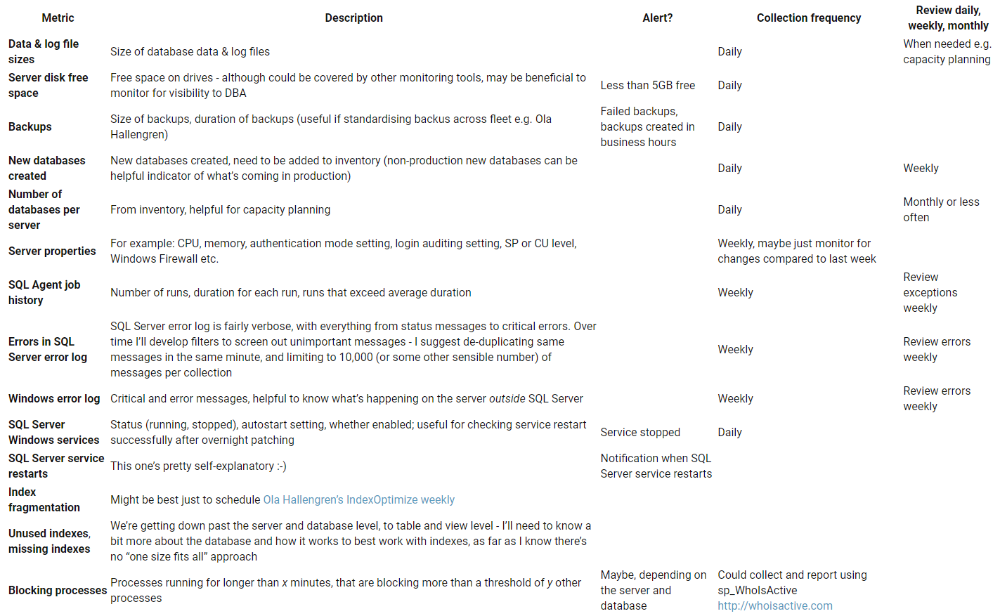

# Automated DBA monitoring for SQL Server

## A Primer

Automated monitoring is a “secret weapon” which calls for help when something’s wrong, stores data to help make decisions, and gives confidence that past known issues are being handled to help me as a DBA sleep better at night.

It would be nice if every problem, now and in the future, was automatically monitored by an intuitive, cheap, flexible tool that only raised the alarm when there was a real problem, at the right time, to the right people.

However, in reality, monitoring is a game of whack-a-mole, built on an ad-hoc collection of tools and technologies, requiring know-how to interpret the often puzzling situations which may be high priority - or just background noise.

As a DBA who’s accountable for the success (or otherwise) of database servers, I’m a fan of creating my own automated monitoring when needed. I’ve never found an off-the-shelf monitoring product that did everything (at least in my experience with SolarWinds, WhatsUp Gold, SCOM and others). Plus, some problems are probably unique to my environment - maybe even of my own making.

Starting with the “big picture” level, some questions to ask of any automated DBA monitoring, or when thinking of my own, are:

### What to monitor
Disk free space, errors in logs, index usage, tempdb contention, new database creation, objects created in the master system database, lack of corruption checks, unexpected DBCC SHRINKFILE taking place; the list goes on, these are just a selection of metrics that come to mind. Servers, networks, database, operating system and applications - what data can I reliably collect, that scales to the number of servers I need to monitor? And like a doctor often records height and weight, I may need to collect “context” metrics like number of processors, number of tempdb files, number of databases etc. to monitor if anything changes over time, as well as allowing comparison between servers.

### How often to collect data
Every minute, day, week, month etc. There may be more than one use for the data - for instance, if not to identify an immediate issue, then to use the data as a “normal operation” baseline.

### How long to store collected data for
Summarising data may mean detailed records can be deleted, saving space. When first implementing monitoring, I try and pay attention to how long I might retain the data. One week is about right for **sp_WhoIsActive** data, and 2 years is probably more than enough for things like database file sizes to provide an idea of growth trends.

### When to start collecting
I find it’s good to collect data if possible when I first encounter an issue, before I’ve analysed and attempted to solve it. An example is query cache issues on a busy server (which did not occur on other servers). That way, after a fix is applied, comparing newly-collected data with the older data will confirm that the problem is being addressed.

### Where to collect from
I try to collect from both production and non-production servers. A question I’ve faced is how much time should be invested in monitoring to allow for differences in functionality of versions of SQL Server. Also worth considering - what data to collect from third-party servers where I may have limited access or reduced support expectations, or cloud servers where the operating system level may be of less relevance than locally-hosted servers.

### Where to store
I’m a DBA, so I’m gonna store collected data in a database.

### How to run
I’ve previously used scripts (PowerShell, VBScript), SSIS packages, SQL Agent jobs, Windows scheduled tasks, existing monitoring tools, and a combination of all the above.

## Part 2

Monitoring is here to stay. There’s never enough disk space, memory, CPU, network throughput. If they ever existed, perfect conditions don’t persist, whether because of a downstream system failing, newly-discovered security issue, change in process, extraordinary amount of load etc. And, systems grow and change to meet new requirements, so yesterday’s monitoring may not meet tomorrow’s uptime goals.

Here are some further “big picture” considerations for automated monitoring for the DBA:

### Impact of monitoring
Like on Schrödinger’s cat, monitoring has an impact. I can recall over-enthusiastic monitoring which caused issues. Need to “monitor the monitor” - perhaps allowing for it to be disabled or dialled back if needed.

### Analysis and reporting
Collected monitoring data is a rich source of information for the DBA. The analysis could be as simple as running a query, or an Excel pivot table, or Reporting Services, or other reporting tools. There may be more than one audience for collected data too - I’m thinking of Windows admins, or management.

### Alerts
Fast-forwarding to when the automated monitoring data is being collected regularly…now, I can use it to send timely alerts, depending on the issue. An alert is a timely notification - it might be an e-mail, SMS, or dashboard item. For instance, if I have a problem with a system creating local backups during business hours, impacting users? A SQL Agent alert could detect and e-mail the DBA. What about multi-day, sustained abnormal growth of a database? Maybe a once-a-week report is the best way to review. Or for a third-party vendor who logs in out of hours to carry out unplanned changes - or a vendor who doesn’t log in when they said they would? Both can be addressed by monitoring, perhaps an e-mailed report at the end of the week that’s CC’d to the vendor and relevant contacts.

### Who alerts should go to, goes hand-in-hand with what information to include in an alert
A goal of alerts from automated monitoring should be triggering action to fix (while avoiding e-mail or dashboard overload). Alerts benefit from specific instructions to support staff to fix the issue or escalate. Over time, automated monitoring may evolve into an automated fix - for instance a Windows service restart or killing a long-running SQL Agent job or blocking process.

### What is most impactful to monitor
Monitoring is like Maslow’s hierarchy - once you’re monitoring and addressing basic things to keep systems up and running, you can focus on problems specific to your environment and situation. I suggest starting with the basics, though. It’s worth looking at what other monitoring Windows or network admins are doing so you don’t double up.

### Continuous improvement
It’s possible to be monitoring a symptom, rather than cause, of an issue, which should lead to a change in monitoring. I’ve also found that particular metrics may no longer be required or valid. Maybe the issue was fixed in a later version of SQL Server or Windows (for instance, the legacy need to allocate disk block sizes for SQL Server 2000).

## Part 3

With some of the broader ideas out of the way, if there’s no monitoring in place and I was the “accidental”/”default” DBA, there are some metrics I’d definitely want to monitor. However, there’s a ton of real-time metrics I haven’t included below like CPU & memory use, number of current connections, disk I/O as at right now. They’re probably not good candidates for “roll-your-own”-type monitoring.

I consider “alerts” in the table below to include an e-mail, SMS or dashboard item that aims to trigger a response to fix. The collection frequency especially is just a guide - closer to real-time might be desirable, but the trade-off is impact on servers and connected apps.

Ideally, monitoring is linked to an inventory of servers and databases; that’s a topic for another blog post, though.

