[TOC]

# Review of Server State

The first step in index analysis is to review the state of the server. Review both the host server environment and the SQL Server instance environment to identify whether there are conditions indicating that there may be indexing issues. By starting at a high level and not looking directly at tables and individual indexes, you can avoid getting blinded by the trees in the forest. Often, when there are hundreds of indexes in dozens of databases, it is easy to get overly focused on an index or table that looks poorly indexed, only to later discover that the table has fewer than a hundred rows in a database with billions of rows in other tables. When analysing the server state, you will look at the following three areas:

- Performance counters
- Wait statistics
- Buffer allocation

Each of these areas provides an idea of where to start focusing the index analysis process. They let the database platform tell you where the performance issues related to indexing may reside.

## Performance Counters

Naturally, you want to look at these performance counters first when performing index analysis. Tracking performance counters over a monitoring period and over time will not provide prescriptive guidance on what to do about indexing issues, but it will provide a point for discovering performance issues and thus where to begin.

For each of the counters, I’ll discuss some general guidelines. These guidelines are generalities that you should take with a grain of salt. Use them to initially guide whether the counter is outside what might be normal on other database platforms. If there is a reason that counters on your platform trend higher than typical, that is the purpose of maintaining the baseline tables. Work with the counter values that are valid for your environment as opposed to those that work best for others.

There are two ways in which performance counters should be analysed. The first is to use Excel and/ or PowerPivot to view graphs and trend lines based on the performance counters. The second is to review the performance counters with a query that takes a snapshot of the information in the performance counter table. The second approach is the approach used in this chapter. The guidelines for the snapshot queries apply to both approaches.

> **Note**
>
> For simplicity, the snapshot analysis queries in this section will be scoped to the database level. In most cases, you will need to execute them against every database on the SQL Server instance. Options for accomplishing this are using `sp_MSForEachDB` and extending the cursors

### Forwarded Records per Second

The performance counter Forwarded Records/sec measures the rate in which forwarded rows are accessed on the server. Generally, the ratio of Forwarded Records/sec should not exceed 10 percent of Batch Requests/sec. This ratio can be a misnomer since Forward Records represents the access of data at the row level and Batch Requests represents a higher-scoped operation. The ratio, though, provides an indicator of when the balance of Forwarded Records/sec may be exceeding an advisable level.

The snapshot query for Forwarded Records, shown in Listing 14-1, provides columns for the **Forward Records/sec** counter and the ratio calculation. In this query, the values are aggregated into minimum, average, and maximum values. The ratio is calculated on each set of collected counters and aggregated after that calculation. The final column, *PctViolation*, shows the percentage of time in which the **Forward Records to Batch Requests** ratio exceeds the 10 percent guideline.

```sql
-- Listing 14-1. Forwarded Records Counter Analysis
USE IndexingMethod;
GO

WITH CounterSummary AS
(
    SELECT create_date,
           server_name,
           MAX (CASE
                    WHEN counter_name = 'Forwarded Records/sec' THEN Calculated_Counter_value
                END
           ) AS "ForwardedRecords",
           MAX (CASE
                    WHEN counter_name = 'Forwarded Records/sec' THEN Calculated_Counter_value
                END
           ) / (NULLIF(MAX (CASE
                                WHEN counter_name = 'Batch Requests/sec' THEN Calculated_Counter_value
                            END
                       ), 0) * 10
               ) AS "ForwardedRecordRatio"
    FROM dbo.IndexingCounters
    WHERE counter_name IN ( 'Forwarded Records/sec', 'Batch Requests/sec' )
    GROUP BY create_date,
             server_name
)
SELECT server_name,
       MIN (ForwardedRecords) AS "MinForwardedRecords",
       AVG (ForwardedRecords) AS "AvgForwardedRecords",
       MAX (ForwardedRecords) AS "MaxForwardedRecords",
       MIN (ForwardedRecordRatio) AS "MinForwardedRecordRatio",
       AVG (ForwardedRecordRatio) AS "AvgForwardedRecordRatio",
       MAX (ForwardedRecordRatio) AS "MaxForwardedRecordRatio",
       100. * SUM (CASE WHEN ForwardedRecordRatio > 1 THEN 1 END) / COUNT (*) AS "PctViolation"
FROM CounterSummary
GROUP BY server_name;
```

When reviewing the output from the snapshot query, there are a few things to ask about the information returned. First, review the minimum and maximum values for the counter and ratio. Is the minimum value close to or at zero? How high is the maximum? How does it compare to previous values collected during monitoring? Is the average value for the counter and ratio closer to the minimum or maximum value? If the volume and peaks of forwarded records is increasing, then further analysis is warranted. Next, consider the *PctViolation* column. Is the percentage greater than 1 percent? If so, further analysis of forwarded records is warranted. If there is a need to dig deeper into Forward Records, the next step is to move the analysis from the server level to the databases.

To provide an example of some forwarded record activity, execute the script in Listing 14-2. This script will create a table with a heap. Then it will insert records into the table and update those records, causing records to be expanded and leading to record forwarding. Finally, a query will access the forwarded records, causing forwarded record access operations.

```sql
-- Listing 14-2. Forwarded Records Example
USE IndexingMethod;
GO

CREATE TABLE dbo.HeapExample (ID INT IDENTITY, FillerData VARCHAR(2000));

INSERT INTO dbo.HeapExample (FillerData)
SELECT REPLICATE ('X', 100)
FROM sys.all_objects;

UPDATE dbo.HeapExample
SET FillerData = REPLICATE ('X', 2000)
WHERE ID % 5 = 1;
GO

SELECT *
FROM dbo.HeapExample
WHERE ID % 3 = 1;
GO 2
```

Once determining that Forwarded Record/sec analysis needs to go into the database, the process will leverage information available in the DMO. There are two DMOs that will help to determine the scope and extent of forwarded records issues. These are `sys.dm_db_index_physical_stats` and `sys.dm_db_index_operational_stats`. For the analysis, the `sys.dm_db_index_operational_stats` information will come from the monitoring table `dbo.index_operational_stats_history`. 

The analysis process, shown in Listing 14-3, involves identifying all the heaps in a database and then checking the physical structure of the heap. This information is then joined to the information collected in `dbo.index_operational_stats_history`. The physical stature of the index is retrieved from `sys.dm_db_index_operational_stats` because the `DETAILED` option for the DMO is required to get the forwarded record information.

```sql
-- Listing 14-3. Forwarded Records Snapshot Query
IF OBJECT_ID ('tempdb..#HeapList') IS NOT NULL 
	DROP TABLE #HeapList;

CREATE TABLE #HeapList (
    database_id                    INT,
    object_id                      INT,
    page_count                     INT,
    avg_page_space_used_in_percent DECIMAL(6, 3),
    record_count                   INT,
    forwarded_record_count         INT
);

DECLARE HEAP_CURS CURSOR FORWARD_ONLY FOR
SELECT object_id
FROM sys.indexes AS i
WHERE index_id = 0;
DECLARE @IndexID INT;
OPEN HEAP_CURS;
FETCH NEXT FROM HEAP_CURS
INTO @IndexID;
WHILE @@FETCH_STATUS = 0
BEGIN
    INSERT INTO #HeapList
    SELECT DB_ID (),
           object_id,
           page_count,
           CAST(avg_page_space_used_in_percent AS DECIMAL(6, 3)),
           record_count,
           forwarded_record_count
    FROM sys.dm_db_index_physical_stats (DB_ID (), @IndexID, 0, NULL, 'DETAILED');
    FETCH NEXT FROM HEAP_CURS
    INTO @IndexID;
END;
CLOSE HEAP_CURS;
DEALLOCATE HEAP_CURS;

SELECT QUOTENAME (DB_NAME (database_id)),
       QUOTENAME (OBJECT_SCHEMA_NAME (object_id)) + '.' + QUOTENAME (OBJECT_NAME (object_id)) AS "ObjectName",
       page_count,
       avg_page_space_used_in_percent,
       record_count,
       forwarded_record_count,
       x.forwarded_fetch_count,
       CAST(100. * forwarded_record_count / record_count AS DECIMAL(6, 3)) AS "forwarded_record_pct",
       CAST(1. * x.forwarded_fetch_count / forwarded_record_count AS DECIMAL(12, 3)) AS "forwarded_row_ratio"
FROM #HeapList AS h
CROSS APPLY (
    SELECT SUM (forwarded_fetch_count) AS "forwarded_fetch_count"
    FROM IndexingMethod.dbo.index_operational_stats_history AS i
    WHERE h.database_id = i.database_id
          AND h.object_id = i.OBJECT_ID
          AND i.index_id = 0
) AS x
WHERE forwarded_record_count > 0
ORDER BY page_count DESC;
```

The results of the snapshot query, shown in Figure 14-1, provide information on all the heaps in a database that have any forwarded records. Through these results, the heaps that have issues with forwarding and forwarded records can be identified. The first columns to pay attention to are *page_count* and *record_count*. 

Heaps with many records with forwarded record issues will be more important than those with few rows. It is worthwhile to focus on those tables that will provide the greatest relief to forwarded records when investigating this counter. The columns *forwarded_record_count* and *forwarded_fetch_count* provide a count of the number of records in a table that have been forwarded and the number of times those forwarded records have been accessed, respectively. These columns provide a scope to the size of the problem. 

The last columns to look at are *forwarded_record_pct* and *forwarded_row_ratio*. These columns detail the percentage of columns that are forwarded and how many times each of the forwarded rows has been accessed.

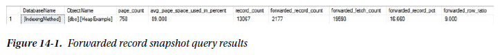

In the example table, the statistics indicate that there is an issue with forwarded records. The table has more than 16 percent of its rows forwarded. Each of these rows has been accessed three times. From the code sample, there have been only three queries executed on the table, meaning that 100 percent of data access has resulted in all forwarded rows being accessed. When analysing the indexes in this database, mitigating the forwarded records for this table would be worthwhile. Do pay special attention to whether forwarded records are being accessed. Mitigating forwarded records on a table that has very high forwarded records but no forwarded record access would not be worth the effort and would have no impact on the Forwarded Records/sec counter.

When heaps that have forwarded record issues have been identified, there are generally two ways in which the forwarded record can be mitigated. The first approach is to change the data types for the columns that are variable to fixed-length data types. For instance, the varchar data type would be changed to char. This approach is not always ideal since it can result in more space being required by the table, and some queries may not accommodate the extra space at the end of character fields and could return incorrect results. The second option is to add a clustered index to the table, which would remove the heap as the organizational method for storing the data in the table. The downside to this approach is in identifying the appropriate key column to cluster the table on. If there is a primary key on the table, it can usually suffice as the clustering index key. There is a third option. The heap can be rebuilt, which will rewrite the heap back to the database file and remove all the forwarded records (using the script in Listing 14-4). This is generally considered a poor approach to resolving forwarded records in heaps since it doesn’t provide a meaningful permanent fix to the issue. Remember, forwarded records aren’t necessarily bad. They do, though, provide a potential performance problem when the ratio of operations for forwarded records starts to increase as compared to batch requests.

```sql
-- Listing 14-4. Rebuild Heap Script
USE IndexingMethod;
GO

ALTER TABLE dbo.HeapExample REBUILD;
```

### FreeSpace Scans per Second

The performance counter **FreeSpace Scans/sec** is another performance counter that is related to heaps. This counter represents the activity that happens when records are being inserted into a table with a heap. During inserts into heaps, there can be activity on the GAM, SGAM, and PFS pages. If the rate of inserts is high enough, contention can happen on these pages. Analysing the values of the **FreeSpace Scan/sec** counter provides an opportunity to keep track of this activity, determine when the volume of activity is increasing, and determine when heaps may need to be analysed further.

Listing 14-5 provides the query to analyse the **FreeSpace Scans/sec** counter. It provides a snapshot of FreeSpace Scan activity on the SQL Server instance. The query provides aggregations of the counter with minimum, average, and maximum values. Similar to the previous counter, this counter also follows recommended guidelines of one **FreeSpace Scan/sec** for every ten Batch Requests. The *PctViolation* column measures the percentage of time that the counter exceeds the guideline.

```sql
-- Listing 14-5. FreeSpace Scans Counter Analysis
USE IndexingMethod;
GO

WITH CounterSummary AS
(
    SELECT create_date,
           server_name,
           MAX (CASE
                    WHEN counter_name = 'FreeSpace Scans/sec' THEN Calculated_Counter_value
                END
           ) AS "FreeSpaceScans",
           MAX (CASE
                    WHEN counter_name = 'FreeSpace Scans/sec' THEN Calculated_Counter_value
                END
           ) / (NULLIF(MAX (CASE
                                WHEN counter_name = 'Batch Requests/sec' THEN Calculated_Counter_value
                            END
                       ), 0) * 10
               ) AS "ForwardedRecordRatio"
    FROM dbo.IndexingCounters
    WHERE counter_name IN ( 'FreeSpace Scans/sec', 'Batch Requests/sec' )
    GROUP BY create_date,
             server_name
)
SELECT server_name,
       MIN (FreeSpaceScans) AS "MinFreeSpaceScans",
       AVG (FreeSpaceScans) AS "AvgFreeSpaceScans",
       MAX (FreeSpaceScans) AS "MaxFreeSpaceScans",
       MIN (ForwardedRecordRatio) AS "MinForwardedRecordRatio",
       AVG (ForwardedRecordRatio) AS "AvgForwardedRecordRatio",
       MAX (ForwardedRecordRatio) AS "MaxForwardedRecordRatio",
       100. * SUM (CASE WHEN ForwardedRecordRatio > 1 THEN 1 END) / COUNT (*) AS "PctViolation"
FROM CounterSummary
GROUP BY server_name;
```

When the **FreeSpace Scans/sec** number is high, the analysis will focus on determining which heaps in the databases have the highest rate of inserts. To identify the tables with the highest inserts on heaps, use the information in the monitoring tables from `sys.dm_db_index_operational_stats`. The column with the information on inserts is *leaf_insert_count*. The query in Listing 14-6 provides a list of the heaps in the monitoring table ***dbo.index_operational_stats_history*** with the most indexes.

```sql
-- Listing 14-6. FreeSpace Scans Snapshot Query
USE IndexingMethod;
GO

SELECT QUOTENAME (DB_NAME (database_id)) AS "database_name",
       QUOTENAME (OBJECT_SCHEMA_NAME (object_id, database_id)) + '.' + QUOTENAME (OBJECT_NAME (object_id, database_id)) AS "ObjectName",
       SUM (leaf_insert_count) AS "leaf_insert_count",
       SUM (leaf_allocation_count) AS "leaf_allocation_count"
FROM dbo.index_operational_stats_history
WHERE index_id = 0
      AND database_id > 4
GROUP BY object_id,
         database_id
ORDER BY leaf_insert_count DESC;
```

Reviewing the table in the demonstration script in Listing 14-3 with the FreeSpace Scan snapshot query yields the results in Figure 14-2. As this example shows, there were thousands of inserts into the heap. While only a single table is shown in the results, the tables that appear at the height of this list are going to be the ones most often contributing to **FreeSpace Scans/sec**.

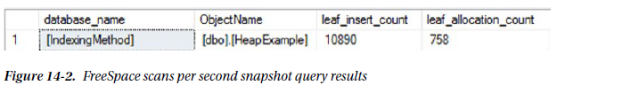

Once the contributing heaps are identified, the best method for mitigating the heaps is to create a clustered index on the tables with the most inserts. Since the counter is based on scans of free space on the GAM, SGAM, and PFS pages, building clustered indexes on the heap tables will move the allocation of pages to IAM pages, which are dedicated to each clustered index.

### Full Scans per Second

Through the performance counter **Full Scans/sec**, the number of full scans on clustered and nonclustered indexes and heaps is measured. Within execution plans, this counter is triggered during index scans and table scans. The higher the rate in which full scans are performed, the more likely that there can be performance issues related to full scans. From a performance perspective, this can impact the **Page Life Expectancy** value as data is churned in memory, and there may be I/O contention as data needs to be brought into memory.

Using the query in Listing 14-7, the current state of **Full Scans/sec** can be analysed for the current monitoring window. As with the previous counters, it is important to consider the relationship between this counter and the Batch Requests/sec counter. When the ratio of **Full Scans/sec** to **Batch Requests/sec** exceeds one for every thousand, there may be an issue with **Full Scans/sec**, which merits further review.

```sql
-- Listing 14-7. Full Scans Counter Analysis
USE IndexingMethod;
GO

WITH CounterSummary AS
(
    SELECT create_date,
           server_name,
           MAX (CASE
                    WHEN counter_name = 'Full Scans/sec' THEN Calculated_Counter_value
                END
           ) AS "FullScans",
           MAX (CASE
                    WHEN counter_name = 'Full Scans/sec' THEN Calculated_Counter_value
                END
           ) / (NULLIF(MAX (CASE
                                WHEN counter_name = 'Batch Requests/sec' THEN Calculated_Counter_value
                            END
                       ), 0) * 1000
               ) AS "FullRatio"
    FROM dbo.IndexingCounters
    WHERE counter_name IN ( 'Full Scans/sec', 'Batch Requests/sec' )
    GROUP BY create_date,
             server_name
)
SELECT server_name,
       MIN (FullScans) AS "MinFullScans",
       AVG (FullScans) AS "AvgFullScans",
       MAX (FullScans) AS "MaxFullScans",
       MIN (FullRatio) AS "MinFullRatio",
       AVG (FullRatio) AS "AvgFullRatio",
       MAX (FullRatio) AS "MaxFullRatio",
       100. * SUM (CASE WHEN FullRatio > 1 THEN 1 ELSE 0 END) / COUNT (*) AS "PctViolation"
FROM CounterSummary
GROUP BY server_name;
```

Before demonstrating how to examine the underlying causes for high **Full Scans/sec** counter values, let’s set up some example statistics. Listing 14-8 will provide a number of full scans that can be collected through the monitoring process detailed in the previous section. Be certain to execute the scripts that collect the monitoring information after executing the example script.

```sql
-- Listing 14-8. Full Scans Example Query
USE AdventureWorks;
GO

SELECT *
FROM Sales.SalesOrderHeader;
GO 10
```

The primary goal is to identify which indexes the Full Scans/sec counter is being affected by. Once the indexes are identified, they need to be analysed to determine whether they are the proper index for that operation or whether there are other performance-tuning tactics required to reduce the use of the index in a full scan operation. The DMO to use for investigating full scans is `sys.dm_db_index_usage_stats` from the monitoring tables; this is the **dbo.index_usage_stats_history** table.

The indexes can be identified using the query shown in Listing 14-9. The snapshot results exclude any indexes with no rows in them. Those indexes are still being utilized for full scans, but mitigating the scans on those indexes would not greatly impact performance. To sort the results, the number of scans on the indexes is multiplied by the number of rows in the table. Sorting in this manner weighs the output to put focus on those indexes that might not have a high impact on reducing the **Full Scans/sec** value but will provide the greatest lift to index performance.

```sql
-- Listing 14-9. Full Scans Snapshot Query
USE IndexingMethod;
GO

SELECT QUOTENAME (DB_NAME (uh.database_id)) AS "database_name",
       QUOTENAME (OBJECT_SCHEMA_NAME (uh.object_id, uh.database_id)) + '.'
       + QUOTENAME (OBJECT_NAME (uh.object_id, uh.database_id)) AS "ObjectName",
       uh.index_id,
       SUM (uh.user_scans) AS "user_scans",
       SUM (uh.user_seeks) AS "user_seeks",
       x.record_count
FROM dbo.index_usage_stats_history AS uh
CROSS APPLY (
    SELECT DENSE_RANK () OVER (ORDER BY ph.create_date DESC) AS "RankID",
           ph.record_count
    FROM dbo.index_physical_stats_history AS ph
    WHERE ph.database_id = uh.database_id
          AND ph.object_id = uh.object_id
          AND ph.index_id = uh.index_id
) AS x
WHERE uh.database_id > 4
      AND x.RankID = 1
GROUP BY uh.database_id,
         uh.object_id,
         uh.index_id,
         x.record_count
ORDER BY SUM (uh.user_scans) * x.record_count DESC;
GO
```

The results of the full scans snapshot query will look similar to the output in Figure 14-3. With this output, the next step is to identify which indexes require further analysis. The purpose of the current analysis is to identify problem indexes for later analysis. Once identified, the next step is to determine where they are being utilized and how to mitigate the full scans in those places.

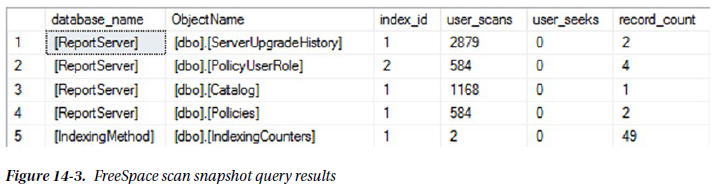

### Index Searches per Second

The performance counter **Index Searches/sec** provides reporting on the rate of index seek on the SQL Server instance. This can include operations such as range scans and key lookups. In most environments, it is preferable to have high **Index Searches/sec** counter values. Along those lines, the higher this performance counter is in relationship to **Full Scans/sec**, the better.

The analysis of Index Searches/sec will begin with reviewing the performance counter information collected over time (shown in Listing 14-10). As mentioned, the ratio of **Index Searches/sec** to **Full Scans/sec** is one of the metrics that can be used to evaluate whether **Index Searches/sec** is indicating a potential indexing issue. The guideline for evaluating the ratio between the two counters is to look for 1,000 Index Searches/sec for every one Full Scans/sec. The analysis query provides this calculation, along with determining the amount of time in which the counter values exceeded this ratio, through the column *PctViolation*.

```sql
-- Listing 14-10. Index Searches Counter Analysis
USE IndexingMethod;
GO

WITH CounterSummary AS
(
    SELECT create_date,
           server_name,
           MAX (CASE
                    WHEN counter_name = 'Index Searches/sec' THEN Calculated_Counter_value
                END
           ) AS "IndexSearches",
           MAX (CASE
                    WHEN counter_name = 'Index Searches/sec' THEN Calculated_Counter_value
                END
           ) / (NULLIF(MAX (CASE
                                WHEN counter_name = 'Full Scans/sec' THEN Calculated_Counter_value
                            END
                       ), 0) * 1000
               ) AS "SearchToScanRatio"
    FROM dbo.IndexingCounters
    WHERE counter_name IN ( 'Index Searches/sec', 'Full Scans/sec' )
    GROUP BY create_date,
             server_name
)
SELECT server_name,
       MIN (IndexSearches) AS "MinIndexSearches",
       AVG (IndexSearches) AS "AvgIndexSearches",
       MAX (IndexSearches) AS "MaxIndexSearches",
       MIN (SearchToScanRatio) AS "MinSearchToScanRatio",
       AVG (SearchToScanRatio) AS "AvgSearchToScanRatio",
       MAX (SearchToScanRatio) AS "MaxSearchToScanRatio",
       100. * SUM (CASE WHEN SearchToScanRatio > 1 THEN 1 END) / COUNT (*) AS "PctViolation"
FROM CounterSummary
GROUP BY server_name;
```

If the analysis indicates an issue with index searches, the first step is to verify that the analysis for **Full Scans/sec** in was completed. That analysis will provide the most insight into which indexes have many full scans, which would contribute to high ratios for **Index Searches/sec**.

Once that analysis is complete, you can begin to identify where there are issues with the ratios of scans to seeks at the index level. Using the query in Listing 14-11, indexes with a high ratio of scans to seeks can be identified. Similar to the performance counter guideline of 1,000 seeks to every one scan, the query returns results for those indexes with fewer than 1,000 seeks for every scan. Since full-scan issues should have been identified in the previous section, the analysis also removes any indexes that do not have seeks against them.

```sql
-- Listing 14-11. Index Searches Snapshot Query
USE IndexingMethod;
GO

SELECT QUOTENAME (DB_NAME (uh.database_id)) AS "database_name",
       QUOTENAME (OBJECT_SCHEMA_NAME (uh.object_id, uh.database_id)) + '.'
       + QUOTENAME (OBJECT_NAME (uh.object_id, uh.database_id)) AS "ObjectName",
       uh.index_id,
       SUM (uh.user_scans) AS "user_scans",
       SUM (uh.user_seeks) AS "user_seeks",
       1. * SUM (uh.user_seeks) / NULLIF(SUM (uh.user_scans), 0) AS "SeekScanRatio",
       x.record_count
FROM dbo.index_usage_stats_history AS uh
CROSS APPLY (
    SELECT DENSE_RANK () OVER (ORDER BY ph.create_date DESC) AS "RankID",
           ph.record_count
    FROM dbo.index_physical_stats_history AS ph
    WHERE ph.database_id = uh.database_id
          AND ph.object_id = uh.object_id
          AND ph.index_id = uh.index_id
) AS x
WHERE uh.database_id > 4
      AND x.RankID = 1
      AND x.record_count > 0
GROUP BY uh.database_id,
         uh.object_id,
         uh.index_id,
         x.record_count
HAVING 1. * SUM (uh.user_seeks) / NULLIF(SUM (uh.user_scans), 0) < 1000
       AND SUM (uh.user_seeks) > 0
ORDER BY 1. * SUM (uh.user_seeks) / NULLIF(SUM (uh.user_scans), 0) DESC,
         SUM (uh.user_scans) DESC;
GO
```

Viewing the results of the snapshot query, shown in Figure 14-4, there are a few indexes identified where the seek-to-scan ratio is quite low. For instance, in the ***AdventureWorks*** database, the table ***Sales.SalesOrderHeader*** has 1,016 scans for every one seek. Indexes such as these are easy to determine as needing further analysis.

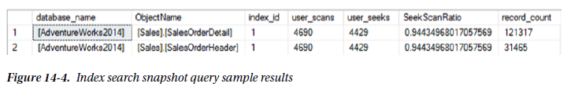

During further analysis, there are a few things you’ll want to pay attention to that might indicate an issue with the indexes identified. First is the current seek versus scan behaviour new to the index; in other words, has the variance been on a common trend that has slowly been getting worse? If the change is sudden, there could be a plan that is no longer using the index as it once did, maybe because of a coding change or bad parameter sniffing. Second is when the change has been gradual; look at increased data volumes and whether a query or feature within the database is being used more than it was previously. This can also hint at changes in how people are using the database and its applications, which is sometimes gradual until it reaches the point where indexing, and the performance the indexes support, suffers.

### Page Splits per Second

Page splits can be resource intensive because the single page is divided between two or more pages and involves locking and, potentially, blocking. The more frequent the page splits, the more likely that indexes will incur blocking and performance will suffer. Also, the fragmentation caused by page splits reduces the size of reads that can be performed in single operations.

To begin analysing the performance counters for a page split, the counter **Page Splits/sec** is utilized. The query in Listing 14-12 provides a method for summarizing page split activity. The query includes the minimum, maximum, and average levels of the performance counter. Along with that, a ratio of **Page Splits/sec** to **Batch Requests/sec** is included. When identifying whether there are issues with page splits on a SQL Server instance, the general rule of thumb is to look for times in which there is more than one page split/sec for every 20 batch requests/sec. Of course, as with the other counter, pay attention to the amount of time, through *PctViolation*, that the counter exceeded the threshold.

```sql
-- Listing 14-12. Page Splits Counter Analysis
USE IndexingMethod;
GO

WITH CounterSummary AS
(
    SELECT create_date,
           server_name,
           MAX (CASE
                    WHEN counter_name = 'Page Splits/sec' THEN Calculated_Counter_value
                END
           ) AS "PageSplits",
           MAX (CASE
                    WHEN counter_name = 'Page Splits/sec' THEN Calculated_Counter_value
                END
           ) / (NULLIF(MAX (CASE
                                WHEN counter_name = 'Batch Requests/sec' THEN Calculated_Counter_value
                            END
                       ), 0) * 20
               ) AS "FullRatio"
    FROM dbo.IndexingCounters
    WHERE counter_name IN ( 'Page Splits/sec', 'Batch Requests/sec' )
    GROUP BY create_date,
             server_name
)
SELECT server_name,
       MIN (PageSplits) AS "MinPageSplits",
       AVG (PageSplits) AS "AvgPageSplits",
       MAX (PageSplits) AS "MaxPageSplits",
       MIN (FullRatio) AS "MinFullRatio",
       AVG (FullRatio) AS "AvgFullRatio",
       MAX (FullRatio) AS "MaxFullRatio",
       100. * SUM (CASE WHEN FullRatio > 1 THEN 1 ELSE 0 END) / COUNT (*) AS "PctViolation"
FROM CounterSummary
GROUP BY server_name;
```

To determine the indexes that are being affected by page splits, you can consider a few values. A couple of the values come from `sys.dm_db_index_operational_stats` or ***dbo.index_operational_stats_history*** from the index monitoring process. These columns report each page allocation that occurs on an index, whether from inserts at the end of the B-tree or page splits in the middle of it. Since you care only about operations that are part of page splits, the next two columns provide information on whether fragmentation from page splits is occurring. To determine fragmentation, the column *avg_fragmentation_in_percent* from `sys.dm_db_index_physical_stats` is included in the monitoring table ***dbo.index_physical_stats_history***. For the average fragmentation, there are two values returned. The first is the last fragmentation value reported for the index; the second is the average of all the fragmentation values collected. See Listing 14-13.

```sql
-- Listing 14-13. Page Splits Snapshot Query
USE IndexingMethod;
GO

SELECT QUOTENAME (DB_NAME (database_id)) AS "database_name",
       QUOTENAME (OBJECT_SCHEMA_NAME (object_id, database_id)) + '.' + QUOTENAME (OBJECT_NAME (object_id, database_id)) AS "ObjectName",
       SUM (leaf_allocation_count) AS "leaf_insert_count",
       SUM (nonleaf_allocation_count) AS "nonleaf_allocation_count",
       MAX (CASE WHEN RankID = 1 THEN x.avg_fragmentation_in_percent END) AS "last_fragmenation",
       AVG (x.avg_fragmentation_in_percent) AS "average_fragmenation"
FROM dbo.index_operational_stats_history AS oh
CROSS APPLY (
    SELECT DENSE_RANK () OVER (ORDER BY ph.create_date DESC) AS "RankID",
           CAST(ph.avg_fragmentation_in_percent AS DECIMAL(6, 3)) AS "avg_fragmentation_in_percent"
    FROM dbo.index_physical_stats_history AS ph
    WHERE ph.database_id = oh.database_id
          AND ph.object_id = oh.object_id
          AND ph.index_id = oh.index_id
) AS x
WHERE database_id > 4
      AND oh.index_id <> 0
      AND (leaf_allocation_count > 0 OR nonleaf_allocation_count > 0)
GROUP BY object_id,
         database_id
ORDER BY leaf_insert_count DESC;
```

Investigating page splits in this manner provides a way to see the number of allocations and pairs that information with fragmentation. A table with low fragmentation and a high *leaf_insert_count*, such as the table ***dbo.IndexingCounters*** shown in Figure 14-5, is not a concern from a page split perspective. On the other hand, ***dbo.index_operational_stats_history*** does show a high amount of fragmentation and *leaf_insert_count*. It would be worthwhile to investigate that index further.

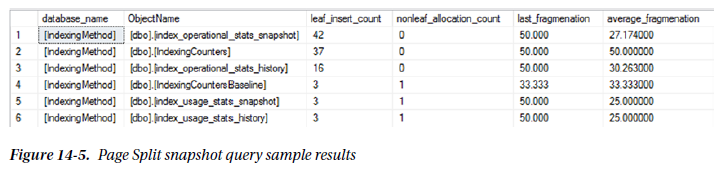

With the indexes requiring more analysis identified, the next step is mitigation. There are a number of ways to mitigate page splits on indexes. The first is to review the fragmentation history for the index. If the index needs to be rebuilt on a regular basis, one of the first things that can be done is to decrease the fill factor on the index. Reducing the fill factor will increase the space remaining on pages after rebuilding indexes, which will reduce the likelihood for page splits. The second strategy for reducing fragmentation is to consider the columns in the index. Are the columns highly volatile and do the values change dramatically? For instance, an index on create_date would likely not have page split issues. But one on *update_date* would be prone to fragmentation. If the usage rates for the index don’t justify the index, it might be worthwhile to remove that index. Or, in multicolumn indexes, move the volatile columns to the right side of the index or add them as included columns. A third approach to mitigating page splits can be to identify where the index is being used. One final approach to mitigating page splits on indexes is to review the data types being used by the index. In some cases, a variable data type might be better suited to being a fixed-length data type.

### Page Lookups per Second

The performance counter **Page Lookups/sec** measures the number of requests made in the SQL Server instance to retrieve individual pages from the buffer pool. When this counter is high, it often means that there is inefficiency in query plans, which can often be addressed through execution plan analysis. Often, high levels of **Page Lookups/sec** are attributed to plans with large numbers of page lookups and row lookups per execution. Generally speaking, in terms of performance issues, the value of **Page Lookups/sec** should not exceed a ratio of 100 operations for each **Batch Request/sec**.

The initial analysis of Page Lookups/sec involves looking at both **Page Lookups/sec** and Batch Request/sec. To start, use the query shown in Listing 14-14; the analysis will include the minimum, maximum, and average **Page Lookups/sec** values over the data from the monitoring period. Next, the minimum, maximum, and average values of the ratio are included, with the *PctViolation* column, for the ratio of **Page Lookups/sec** to **Batch Request/sec** in each time period. The violation calculation verified whether the ratio of operations exceeds 100 to 1.

```sql
-- Listing 14-14. Page Lookups Counter Analysis
USE IndexingMethod;
GO

WITH CounterSummary AS
(
    SELECT create_date,
           server_name,
           MAX (CASE
                    WHEN counter_name = 'Page Lookups/sec' THEN Calculated_Counter_value
                END
           ) AS "PageLookups",
           MAX (CASE
                    WHEN counter_name = 'Page Lookups/sec' THEN Calculated_Counter_value
                END
           ) / (NULLIF(MAX (CASE
                                WHEN counter_name = 'Batch Requests/sec' THEN Calculated_Counter_value
                            END
                       ), 0) * 100
               ) AS "PageLookupRatio"
    FROM dbo.IndexingCounters
    WHERE counter_name IN ( 'Page Lookups/sec', 'Batch Requests/sec' )
    GROUP BY create_date,
             server_name
)
SELECT server_name,
       MIN (PageLookups) AS "MinPageLookups",
       AVG (PageLookups) AS "AvgPageLookups",
       MAX (PageLookups) AS "MaxPageLookups",
       MIN (PageLookupRatio) AS "MinPageLookupRatio",
       AVG (PageLookupRatio) AS "AvgPageLookupRatio",
       MAX (PageLookupRatio) AS "MaxPageLookupRatio",
       100. * SUM (CASE WHEN PageLookupRatio > 1 THEN 1 ELSE 0 END) / COUNT (*) AS "PctViolation"
FROM CounterSummary
GROUP BY server_name;
```

As with the other counters, when the analysis dictates that there are potential problems with the counter, the next step is to dig deeper. There are three approaches that can be taken to address high **Page Lookups/sec** values. The first is to query `sys.dm_exec_query_stats` to identify queries that are executed often with high I/O; you can find more information on this DMV at http://msdn.microsoft.com/en-us/library/ms189741.aspx. Those queries need to reviewed, and a determination needs to be made whether the queries are utilizing an excessive amount of I/O. Another approach is to review the database in the SQL Server instance for missing indexes. The third approach, which will be detailed in this section, is to review the occurrences of lookups on clustered indexes and heaps.

To investigate lookups on clustered indexes and heaps, the primary source for this information is the DMO `sys.dm_db_index_usage_stats`. Thanks to the monitoring implemented in the previous chapter, this information is available in the table ***dbo.index_usage_stats_history***. To perform the analysis, use the query in Listing 14-15; you’ll review lookups, seeks, and scans that have occurred from a user perspective. With these values, the query calculates the ratio of user lookups to user seeks and returns all that have a ratio higher than 100 to 1.

```sql
-- Listing 14-15. Page Lookups Snapshot Query
USE IndexingMethod;
GO

SELECT QUOTENAME (DB_NAME (uh.database_id)) AS "database_name",
       QUOTENAME (OBJECT_SCHEMA_NAME (uh.object_id, uh.database_id)) + '.'
       + QUOTENAME (OBJECT_NAME (uh.object_id, uh.database_id)) AS "ObjectName",
       uh.index_id,
       SUM (uh.user_lookups) AS "user_lookups",
       SUM (uh.user_seeks) AS "user_seeks",
       SUM (uh.user_scans) AS "user_scans",
       x.record_count,
       CAST(1. * SUM (uh.user_lookups) / IIF(SUM (uh.user_seeks) = 0, 1, SUM (uh.user_seeks)) AS DECIMAL(18, 2)) AS "LookupSeekRatio"
FROM dbo.index_usage_stats_history AS uh
CROSS APPLY (
    SELECT DENSE_RANK () OVER (ORDER BY ph.create_date DESC) AS "RankID",
           ph.record_count
    FROM dbo.index_physical_stats_history AS ph
    WHERE ph.database_id = uh.database_id
          AND ph.object_id = uh.object_id
          AND ph.index_id = uh.index_id
) AS x
WHERE uh.database_id > 4
      AND x.RankID = 1
      AND x.record_count > 0
GROUP BY uh.database_id,
         uh.object_id,
         uh.index_id,
         x.record_count
HAVING CAST(1. * SUM (uh.user_lookups) / IIF(SUM (uh.user_seeks) = 0, 1, SUM (uh.user_seeks)) AS DECIMAL(18, 2)) > 100
ORDER BY 1. * SUM (uh.user_lookups) / IIF(SUM (uh.user_seeks) = 0, 1, SUM (uh.user_seeks)) DESC;
GO
```

Once indexes with issues are identified, the next step is to determine how and where the indexes are being used.

### Lock Wait Time

Some performance counters can be used to determine whether there is pressure on the indexes based on their usage. One such counter is **Lock Wait Time (ms)**. This counter measures the amount of time, in milliseconds, that SQL Server spends waiting to implement a lock on a table, index, or page. There aren’t any good values for this counter. Generally, the lower this value, the better, but what “low” means is entirely dependent on the database platform and the applications that are accessing it.

Since there are no guidelines for the level at which the values from **Lock Wait Time(ms)** are good or bad, the best method for evaluating the counter is to compared it to the baseline values. In this case, collecting a baseline becomes incredibly important in terms of being able to monitor when index performance related to lock wait time has occurred. Using the query in Listing 14-16, the **Lock Wait Time (ms)** value is compared to the available baseline values. For both the baseline and the values from the monitoring period, an aggregate of the counter values is provided for the minimum, maximum, average, and standard deviation. These aggregations assist in providing a profile of the state of the counter and whether it has increased or decreased compared to the baseline.

```sql
-- Listing 14-16. Lock Wait Time Counter Analysis
USE IndexingMethod;
GO

WITH CounterSummary AS
(
    SELECT create_date,
           server_name,
           instance_name,
           MAX (CASE
                    WHEN counter_name = 'Lock Wait Time (ms)' THEN Calculated_Counter_value
                END
           ) / 1000 AS "LockWaitTime"
    FROM dbo.IndexingCounters
    WHERE counter_name = 'Lock Wait Time (ms)'
    GROUP BY create_date,
             server_name,
             instance_name
)
SELECT CONVERT (VARCHAR(50), MAX (create_date), 101) AS "CounterDate",
       server_name,
       instance_name,
       MIN (LockWaitTime) AS "MinLockWaitTime",
       AVG (LockWaitTime) AS "AvgLockWaitTime",
       MAX (LockWaitTime) AS "MaxLockWaitTime",
       STDEV (LockWaitTime) AS "StdDevLockWaitTime"
FROM CounterSummary
GROUP BY server_name,
         instance_name
UNION ALL
SELECT 'Baseline: ' + CONVERT (VARCHAR(50), start_date, 101) + ' --> ' + CONVERT (VARCHAR(50), end_date, 101),
       server_name,
       instance_name,
       minimum_counter_value / 1000,
       maximum_counter_value / 1000,
       average_counter_value / 1000,
       standard_deviation_counter_value / 1000
FROM dbo.IndexingCountersBaseline
WHERE counter_name = 'Lock Wait Time (ms)'
ORDER BY instance_name,
         CounterDate DESC;
```

As an example, in Figure 14-6, the average and maximum lock wait times have increased from the baseline values. In a production environment, an increase in the average lock wait over the baseline of about eight seconds is cause for concern. Also, the increase in the range to the maximum value is something to investigate. Based on these results, the duration of time spent waiting to acquire locks is increasing, which is likely going to impact users.

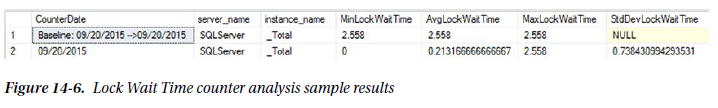

In this case, it would be advisable to investigate the lock wait time further. To do so, you will want to investigate which indexes in the SQL Server instance are generating the most lock wait time by using the query in Listing 14-17. This information is found in the DMO `sys.dm_db_index_operational_stats` or the monitoring table ***dbo.index_operational_stats_history***. The columns reviewed for Lock Wait Time are *row_lock_wait_count*, *row_lock_wait_count*, *row_lock_wait_count*, and *page_lock_wait_in_ms*. These columns report the number of waits per index and the time for those waits. As the columns indicate, there are locks at both the row and page levels; most often the variations between the lock types correlate with seek and scan operations on the index.

```sql
-- Listing 14-17. Lock Wait Time Snapshot Query
USE IndexingMethod;
GO

SELECT QUOTENAME (DB_NAME (database_id)) AS "database_name",
       QUOTENAME (OBJECT_SCHEMA_NAME (object_id, database_id)) + '.' + QUOTENAME (OBJECT_NAME (object_id, database_id)) AS "ObjectName",
       index_id,
       SUM (row_lock_wait_count) AS "row_lock_wait_count",
       SUM (row_lock_wait_in_ms) / 1000. AS "row_lock_wait_in_sec",
       ISNULL (SUM (row_lock_wait_in_ms) / NULLIF(SUM (row_lock_wait_count), 0) / 1000., 0) AS "avg_row_lock_wait_in_sec",
       SUM (page_lock_wait_count) AS "page_lock_wait_count",
       SUM (page_lock_wait_in_ms) / 1000. AS "page_lock_wait_in_sec",
       ISNULL (SUM (page_lock_wait_in_ms) / NULLIF(SUM (page_lock_wait_count), 0) / 1000., 0) AS "avg_page_lock_wait_in_sec"
FROM dbo.index_operational_stats_history AS oh
WHERE database_id > 4
      AND (row_lock_wait_in_ms > 0 OR page_lock_wait_in_ms > 0)
GROUP BY database_id,
         object_id,
         index_id;
```

Looking at the results of the snapshot query, shown in Figure 14-7, there are a couple things to point out. First, in this example, all the locks are occurring across the pages of the table, not at the row level. This can result in larger-scale blocking since more than the rows being accessed will be locked. Also, the average page lock is about seven seconds. For most environments, this is an excessive amount of time for locking. Based on this information, you should definitely further investigate the clustered index (index_id=1) on the table ***Person.Person***.

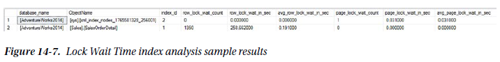

When you need to dig deeper into an index and its usage, the next step is to determine which execution plans are utilizing the index. Then optimize either the queries or the index to reduce locking. In some cases, if the index is not critical to the table, it might be better to remove the index and allow other indexes to satisfy the queries.

### Lock Waits per Second

With **Lock Waits/sec**, the counter measures the number of lock requests that could not be satisfied immediately. For these requests, SQL Server waited until the row or page was available for the lock before granting the lock. As with the other counter, this counter does not have any specific guidelines on what “good” values are. For these, you should turn to the baseline and compare and contrast against it to determine when the counter is outside normal operations.

The analysis of Lock Waits/sec includes the same minimum, maximum, average, and standard deviation aggregations as used for **Lock Wait Time(ms)**. These values are aggregated for both the percounter table ***dbo.IndexingCounters*** and the baseline table ***dbo.IndexingCountersBaseline***, shown in Listing 14-18. Figure 14-8 displays the results from the query.

```sql
-- Listing 14-18. Lock Waits Counter Analysis
USE IndexingMethod;
GO

WITH CounterSummary AS
(
    SELECT create_date,
           server_name,
           instance_name,
           MAX (CASE
                    WHEN counter_name = 'Lock Waits/sec' THEN Calculated_Counter_value
                END
           ) AS "LockWaits"
    FROM dbo.IndexingCounters
    WHERE counter_name = 'Lock Waits/sec'
    GROUP BY create_date,
             server_name,
             instance_name
)
SELECT CONVERT (VARCHAR(50), MAX (create_date), 101) AS "CounterDate",
       server_name,
       instance_name,
       MIN (LockWaits) AS "MinLockWait",
       AVG (LockWaits) AS "AvgLockWait",
       MAX (LockWaits) AS "MaxLockWait",
       STDEV (LockWaits) AS "StdDevLockWait"
FROM CounterSummary
GROUP BY server_name,
         instance_name
UNION ALL
SELECT 'Baseline: ' + CONVERT (VARCHAR(50), start_date, 101) + ' --> ' + CONVERT (VARCHAR(50), end_date, 101),
       server_name,
       instance_name,
       minimum_counter_value / 1000,
       maximum_counter_value / 1000,
       average_counter_value / 1000,
       standard_deviation_counter_value / 1000
FROM dbo.IndexingCountersBaseline
WHERE counter_name = 'Lock Waits/sec'
ORDER BY instance_name,
         CounterDate DESC;
```

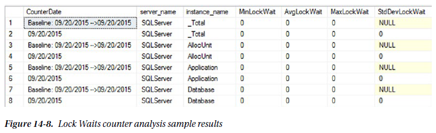

There will be times, such as those included in Figure 14-8, when Lock Wait/sec is not an issue, but there were issues with **Lock Wait Time(ms)**. Those cases point to long duration blocking situations. On the other hand, **Lock Wait/sec** is important to monitor since it will indicate when there is widespread blocking. The blocking may not be long in duration, but it is widespread; a single long block can cause significant performance issues.

In a situation with widespread blocking, as indicated by high values for Lock Wait/sec, the analysis will require investigating the statistics of indexes using the DMO `sys.dm_db_index_operational stats`. With the monitoring process, this information will be available in the table ***dbo.index_operational_stats_history***. Using the query in Listing 14-19, the count and percentage of locks that wait can be determined. As with **Lock Wait Time(ms)**, this counter analysis also looks at statistics at the row and page levels.

```sql
-- Listing 14-19. Lock Waits Snapshot Query
USE IndexingMethod;
GO

SELECT QUOTENAME (DB_NAME (database_id)) AS "database_name",
       QUOTENAME (OBJECT_SCHEMA_NAME (object_id, database_id)) + '.' + QUOTENAME (OBJECT_NAME (object_id, database_id)) AS "ObjectName",
       index_id,
       SUM (row_lock_count) AS "row_lock_count",
       SUM (row_lock_wait_count) AS "row_lock_wait_count",
       ISNULL (SUM (row_lock_wait_count) / NULLIF(SUM (row_lock_count), 0), 0) AS "pct_row_lock_wait",
       SUM (page_lock_count) AS "page_lock_count",
       SUM (page_lock_wait_count) AS "page_lock_wait_count",
       ISNULL (SUM (page_lock_wait_count) / NULLIF(SUM (page_lock_count), 0), 0) AS "pct_page_lock_wait"
FROM dbo.index_operational_stats_history AS oh
WHERE database_id > 4
      AND (row_lock_wait_in_ms > 0 OR page_lock_wait_in_ms > 0)
GROUP BY database_id,
         object_id,
         index_id;
```

Indexes that have a high percentage of lock waits to locks are prime for index tuning. Often, when there are excessive lock waits on a database, the end users will see slowness in the applications and, in some of the worse cases, timeouts in the application. The aim of analysing this counter is to identify indexes that can be optimized and then to investigate where the indexes are being used. Once this is done, address the causes for the locks and tune the indexes and queries to reduce the locking on the index.

### Number of Deadlocks per Second

In extreme cases, poor indexing and excessive lock blocking can lead to deadlocks. Deadlocks occur in situations where locks have been placed by two or more transactions in which the locking order of one of the transactions is prevented from acquiring and/or releasing its locks because of the locks of the other transactions. There are a number of ways to address deadlocking, one of which is to improve indexing.

To determine whether deadlocks are occurring on the SQL Server instance, review the performance counters collected during the monitoring process. The query in Listing 14-20 provides an overview of the deadlock rate during the monitoring window. The query returns aggregate values for the minimum, average, maximum, and standard deviation for the deadlocks on the server.

```sql
-- Listing 14-20. Number of Deadlocks Counter Analysis
USE IndexingMethod;
GO

WITH CounterSummary AS
(
    SELECT create_date,
           server_name,
           Calculated_Counter_value AS "NumberDeadlocks"
    FROM dbo.IndexingCounters
    WHERE counter_name = 'Number of Deadlocks/sec'
)
SELECT server_name,
       MIN (NumberDeadlocks) AS "MinNumberDeadlocks",
       AVG (NumberDeadlocks) AS "AvgNumberDeadlocks",
       MAX (NumberDeadlocks) AS "MaxNumberDeadlocks",
       STDEV (NumberDeadlocks) AS "StdDevNumberDeadlocks"
FROM CounterSummary
GROUP BY server_name;
```

In general, a well-tuned database platform should not have any deadlocks occurring. When they occur, each should be investigated to determine the root cause for the deadlock. Before a deadlock can be examined, though, the deadlock first needs to be retrieved. There are a number of ways in which deadlock information can be collected from SQL Server. These include trace flags, SQL Profiler, and event notifications. Another method is through Extended Events, using the built-in *system_health* session. The query in Listing 14-21 returns a list of all the deadlocks that are currently in the ring_buffer for that session.

```sql
-- Listing 14-21. System-Health Deadlock Query
USE IndexingMethod;
GO

WITH deadlock AS
(
    SELECT CAST(target_data AS XML) AS "target_data"
    FROM sys.dm_xe_session_targets AS st
    INNER JOIN sys.dm_xe_sessions AS s
        ON s.address = st.event_session_address
    WHERE name = 'system_health'
          AND target_name = 'ring_buffer'
)
SELECT c.value ('(@timestamp)[1]', 'datetime') AS "event_timestamp",
       c.query ('data/value/deadlock')
FROM deadlock AS d
CROSS APPLY target_data.nodes ('//RingBufferTarget/event') AS t(c)
WHERE c.exist ('.[@name = "xml:deadlock_report"]') = 1;
```

When deadlocks have been identified, they are returned in an XML document. For most, reading the XML documents is not a natural way to examine a deadlock. Instead, it is often preferable to review the deadlock graph that is associated with the deadlock, such as the one shown in Figure 14-9. To obtain a deadlock graph for any of the deadlocks returned by Listing 14-21, open the deadlock XML document in SQL Server Management Studio and then save the file with an ***.xdl*** extension. When the file is re-opened, it will open with the deadlock graph instead of as an XML document.

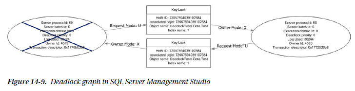

Once deadlocks are identified, you must determine their cause to determine how to prevent them from reoccurring. A common issue that causes deadlocks is the order of operations between numerous transactions. This cause is often difficult to resolve since it may require rewriting parts of applications. To address deadlocks, one of the easiest approaches is to decrease the amount of time in which the transaction occurs. Indexing the tables that are accessed is a typical approach that can resolve deadlocks in many cases by shrinking the window in which deadlocks can be created.

## Wait Statistics

The analysis process for wait statistics is similar to that of performance counters. For both sets of data, the information points to areas where resources are potentially being taxed and identifying the resources and indicating next steps. A lot of the same processes for performance counters apply to wait statistics. One main difference between the two sets of information is that wait statistics are looked at as a whole, and their value is determined as a relationship of themselves to other wait statistics on the SQL Server instance.

Because of this difference, when reviewing wait statistics, there is only a single query required for analysis of the wait stats. Before using the wait statistics analysis query, provided in Listing 14-22, there are a few aspects to wait statistics analysis that should be explained. First, as the list of ignore wait stats shows, there are some wait states that accumulate regardless of the activity on the server. For these, there isn’t any value in investigating behaviour related to them, either because they are just the ticking of CPU time on the server or they are related to internal operations that can’t be affected. Second, the value in wait statistics is in looking at them in relationship to the time that has transpired on the server. While one wait state being higher than another is important, without knowing the amount of time that has transpired, there is no scale by which to measure the pressure the wait state is having on the server. To accommodate for this, the waits from the first set of results in the monitoring table are ignored, and the date between them and the last collection point is used to calculate the time that has transpired. The length of time that a wait state occurred compared to the total time provides the values needed to determine the pressure of the wait state on the SQL Server instance.

```sql
-- Listing 14-22. Wait Statistics Analysis Query
USE IndexingMethod;
GO

WITH WaitStats AS
(
    SELECT DENSE_RANK () OVER (ORDER BY w.create_date ASC) AS "RankID",
           create_date,
           wait_type,
           waiting_tasks_count,
           wait_time_ms,
           max_wait_time_ms,
           signal_wait_time_ms,
           MIN (create_date) OVER () AS "min_create_date",
           MAX (create_date) OVER () AS "max_create_date"
    FROM dbo.wait_stats_history AS w
    WHERE wait_type NOT IN ( 'CLR_SEMAPHORE', 'LAZYWRITER_SLEEP', 'RESOURCE_QUEUE', 'SLEEP_TASK', 'SLEEP_SYSTEMTASK',
                             'SQLTRACE_BUFFER_FLUSH', 'WAITFOR', 'LOGMGR_QUEUE', 'CHECKPOINT_QUEUE',
                             'REQUEST_FOR_DEADLOCK_SEARCH', 'XE_TIMER_EVENT', 'BROKER_TO_FLUSH', 'BROKER_TASK_STOP',
                             'CLR_MANUAL_EVENT', 'CLR_AUTO_EVENT', 'DISPATCHER_QUEUE_SEMAPHORE',
                             'FT_IFTS_SCHEDULER_IDLE_WAIT', 'XE_DISPATCHER_WAIT', 'XE_DISPATCHER_JOIN',
                             'SQLTRACE_INCREMENTAL_FLUSH_SLEEP', 'ONDEMAND_TASK_QUEUE', 'BROKER_EVENTHANDLER',
                             'SLEEP_BPOOL_FLUSH', 'DIRTY_PAGE_POLL', 'HADR_FILESTREAM_IOMGR_IOCOMPLETION'
)
)
SELECT wait_type,
       DATEDIFF (ms, min_create_date, max_create_date) AS "total_time_ms",
       SUM (waiting_tasks_count) AS "waiting_tasks_count",
       SUM (wait_time_ms) AS "wait_time_ms",
       CAST(1. * SUM (wait_time_ms) / SUM (waiting_tasks_count) AS DECIMAL(18, 3)) AS "avg_wait_time_ms",
       CAST(100. * SUM (wait_time_ms) / DATEDIFF (ms, min_create_date, max_create_date) AS DECIMAL(18, 3)) AS "pct_time_in_wait",
       SUM (signal_wait_time_ms) AS "signal_wait_time_ms",
       CAST(100. * SUM (signal_wait_time_ms) / NULLIF(SUM (wait_time_ms), 0) AS DECIMAL(18, 3)) AS "pct_time_runnable"
FROM WaitStats
WHERE RankID <> 1
GROUP BY wait_type,
         min_create_date,
         max_create_date
ORDER BY SUM (wait_time_ms) DESC;
```

The query includes a number of calculations to help identify when there are issues with specific wait types. To best understand the information provided, see the definitions provided in Table 14-1. These calculations and their definitions will help focus the performance issues related to wait statistics.

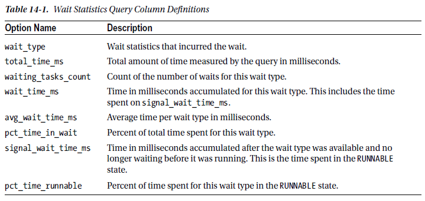

When reviewing the results of the wait statistics query, shown in Figure 14-10, there are two thresholds to watch. First, if any of the waits exceed 5 percent of the total wait time, there is likely a bottleneck related to that wait type, and further investigation into the wait should happen. Similarly, if any of the waits exceed 1 percent of the time, they should be considered for further analysis but not before reviewing the items with higher waits. One thing to pay close attention to when reviewing wait statistics is that if the time spent on the wait is mostly because of signal wait time, then the resource contention can be better resolved by first focusing on CPU pressure on the server.

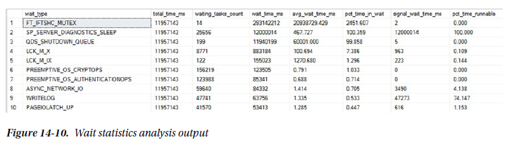

Once wait states with issues have been identified, the next step is to review the wait and the recommended courses of actions for the wait. Since this chapter focuses on more index-centric wait types, I’ll focus on those definitions. To learn more about the other wait types, review the Books Online topic for `sys.dm_os_wait_stats` (Transact-SQL).

### CXPACKET

The CXPACKET wait type occurs when there are waits due to **parallel query execution**, otherwise known as **parallelism**. There are two main scenarios when parallel queries can experience CXPACKET waits. The first is when one of the threads from the parallel query is blocked by a thread already on the scheduler. The second is when one of the threads from the parallel query takes longer to execute than the rest of the threads and the rest of the threads have to wait for the slower thread to complete. The first cause is the more common cause for parallel waits, but it is outside the scope of this book. The second cause, though, can be addressed through indexing. And often, by addressing the second reason for CXPACKET waits, the first cause of parallel waits can be mitigated.

Two approaches that are common for addressing CXPACKET waits is to adjust the max degree of parallelism and cost threshold for parallelism server properties. As with the first cause of parallelism waits, addressing parallelism with these server properties is outside the context of the book. There are valid approaches for utilizing these two properties, but the focus here is on indexing rather than constraining the degree and cost of parallelism. For a simple explanation, the max degree of parallelism limits the total number of cores that any single query can use during parallel processing. Alternatively, the cost threshold for parallelism increases the threshold in which SQL Server determines that a query can use parallelism, without limiting the scope of the parallelism.

CXPACKET waits can be addressed through indexing, which is paired with query tuning. To address the indexing for queries running in parallel, you need to first identify the queries that are using parallelism. There are two methods to do so. The first approach is to examine execution plans that have used parallelism in previous executions. The second is to retrieve execution plans for the parallel queries that are using parallelism and are experiencing CXPACKET waits.

For the first approach, using the plan cache involves identifying the execution plans that are utilizing parallelism and tuning those that are executed most often to reduce their I/O or remove the need for a parallel query. The need for the parallel query can sometimes be attributed to improper indexing on the underlying tables. The query in Listing 14-23 provides a list of execution plans in the plan cache that utilize parallelism.

```sql
-- Listing 14-23. Execution Plans that Utilize Parallelism
SET TRANSACTION ISOLATION LEVEL READ UNCOMMITTED;
WITH XMLNAMESPACES (DEFAULT 'http://schemas.microsoft.com/sqlserver/2004/07/showplan')
SELECT COALESCE (
           DB_NAME (p.dbid), p.query_plan.value ('(//RelOp/OutputList/ColumnReference/@Database)[1]', 'nvarchar(128)')
       ) AS "database_name",
       DB_NAME (p.dbid) + '.' + OBJECT_SCHEMA_NAME (p.objectid, p.dbid) + '.' + OBJECT_NAME (p.objectid, p.dbid) AS "object_name",
       cp.objtype,
       p.query_plan,
       cp.usecounts AS "use_counts",
       cp.plan_handle,
       CAST('<?query --' + CHAR (13) + q.text + CHAR (13) + '--?>' AS XML) AS "sql_text"
FROM sys.dm_exec_cached_plans AS cp
CROSS APPLY sys.dm_exec_query_plan (cp.plan_handle) AS p
CROSS APPLY sys.dm_exec_sql_text (cp.plan_handle) AS q
WHERE cp.cacheobjtype = 'Compiled Plan'
      AND p.query_plan.exist ('//RelOp[@Parallel = "1"]') = 1
ORDER BY COALESCE (DB_NAME (p.dbid), p.query_plan.value ('(//RelOp/OutputList/ColumnReference/@
Database)[1]', 'nvarchar(128)')),
         usecounts DESC;
```

The other method for parallelism waits is to investigate plans that are currently executing. There are two ways to retrieve the list of plans. The first is to query the sys.dm_exec_* DMOs to identify what statements are currently using multiple workers, such as the query in Listing 14-24. This query provides a list of currently executing parallel plans.

```sql
-- Listing 14-24. Parallel Queries Currently Executing
WITH executing AS
(
    SELECT er.session_id,
           er.request_id,
           MAX (ISNULL (exec_context_id, 0)) AS "number_of_workers",
           er.sql_handle,
           er.statement_start_offset,
           er.statement_end_offset,
           er.plan_handle
    FROM sys.dm_exec_requests AS er
    INNER JOIN sys.dm_os_tasks AS t
        ON er.session_id = t.session_id
    INNER JOIN sys.dm_exec_sessions AS es
        ON er.session_id = es.session_id
    WHERE es.is_user_process = 0x1
    GROUP BY er.session_id,
             er.request_id,
             er.sql_handle,
             er.statement_start_offset,
             er.statement_end_offset,
             er.plan_handle
)
SELECT QUOTENAME (DB_NAME (st.dbid)) AS "database_name",
       QUOTENAME (OBJECT_SCHEMA_NAME (st.objectid, st.dbid)) + '.' + QUOTENAME (OBJECT_NAME (st.objectid, st.dbid)) AS "object_name",
       e.session_id,
       e.request_id,
       e.number_of_workers,
       SUBSTRING (
           st.text,
           e.statement_start_offset / 2,
           (CASE
                WHEN e.statement_end_offset = -1 THEN LEN (CONVERT (NVARCHAR(MAX), st.text)) * 2
                ELSE e.statement_end_offset
            END - e.statement_start_offset
           ) / 2
       ) AS "query_text",
       qp.query_plan
FROM executing AS e
CROSS APPLY sys.dm_exec_sql_text (e.plan_handle) AS st
CROSS APPLY sys.dm_exec_query_plan (e.plan_handle) AS qp
WHERE number_of_workers > 0;
```

The second way is to start an Extended Events session, capture transaction information, and then group that information on the available call stack. The session, defined in Listing 14-25, retrieves all the parallel waits as they occur and groups them by their T-SQL stack. The T-SQL stack contains all the SQL statements that contribute to a final execution point. For example, drilling through an execution stack can provide information on a stored procedure that is executing a function that executes a single T-SQL statement. This provides information that can be used to track where the parallel wait is occurring. These statements are grouped using the histogram target, which allows you to minimize the size of the collection and focus on the items causing the most CXPACKET waits on the system.

```sql
-- Listing 14-25. Extended Events Session for CXPACKET
IF EXISTS (SELECT * FROM sys.server_event_sessions WHERE name = 'ex_cxpacket')
    DROP EVENT SESSION ex_cxpacket ON SERVER;
GO
CREATE EVENT SESSION ex_cxpacket
ON SERVER
    ADD EVENT sqlos.wait_info
    (ACTION (sqlserver.plan_handle, sqlserver.tsql_stack)
     WHERE (wait_type = (191) AND sqlserver.is_system = (0))
    -- 191 in SQL Server 2012
    -- 187 in SQL Server 2008/R2
    )
    ADD TARGET package0.histogram
    (SET filtering_event_name = N'sqlos.wait_info', slots = (2048), source = N'sqlserver.tsql_stack', source_type = (1))
WITH (STARTUP_STATE = ON);
GO
ALTER EVENT SESSION ex_cxpacket ON SERVER STATE = START;
GO
```

Once the Extended Events session has collected data for a while, the sessions with the most waits can be looked at more closely. Listing 14-26 provides a list of all the CXPACKET waits that have been collected and the statements and query plans associated with them. Once you know these, investigate the indexes being used to determine which are resulting in low selectivity or unexpected scans.

```sql
-- Listing 14-26. Query to View CXPACKET Extended Events Session
WITH XData AS
(
    SELECT CAST(target_data AS XML) AS "TargetData"
    FROM sys.dm_xe_session_targets AS st
    INNER JOIN sys.dm_xe_sessions AS s
        ON s.address = st.event_session_address
    WHERE name = 'ex_cxpacket'
          AND target_name = 'histogram'
),
     ParsedEvent AS
(
    SELECT c.value ('(@count)[1]', 'bigint') AS "event_count",
           c.value ('xs:hexBinary(substring((value/frames/frame/@handle)[1],3))', 'varbinary(255)') AS "sql_handle",
           c.value ('(value/frames/frame/@offsetStart)[1]', 'int') AS "statement_start_offset",
           c.value ('(value/frames/frame/@offsetEnd)[1]', 'int') AS "statement_end_offset"
    FROM XData AS d
    CROSS APPLY TargetData.nodes ('//Slot') AS t(c)
)
SELECT QUOTENAME (DB_NAME (st.dbid)) AS "database_name",
       QUOTENAME (OBJECT_SCHEMA_NAME (st.objectid, st.dbid)) + '.' + QUOTENAME (OBJECT_NAME (st.objectid, st.dbid)) AS "object_name",
       e.event_count,
       SUBSTRING (
           st.text,
           e.statement_start_offset / 2,
           (CASE
                WHEN e.statement_end_offset = -1 THEN LEN (CONVERT (NVARCHAR(MAX), st.text)) * 2
                ELSE e.statement_end_offset
            END - e.statement_start_offset
           ) / 2
       ) AS "query_text",
       qp.query_plan
FROM ParsedEvent AS e
CROSS APPLY sys.dm_exec_sql_text (e.sql_handle) AS st
CROSS APPLY (
    SELECT plan_handle
    FROM sys.dm_exec_query_stats AS qs
    WHERE e.sql_handle = qs.sql_handle
    GROUP BY plan_handle
) AS x
CROSS APPLY sys.dm_exec_query_plan (x.plan_handle) AS qp
ORDER BY e.event_count DESC;
```

### IO_COMPLETION

The IO_COMPLETION wait type happens when SQL Server is waiting for I/O operations to complete for non-data-page I/Os. Even though this wait is related to non-data operations, there are still some indexing-related actions that can be taken when this wait is high for the SQL Server instance.

First, review the state of Full Scans/sec on the server. If there is an issue with that performance counter, the operations under that counter could bleed through to non-data pages that are being used to manage the indexes. In cases where the two of these are high, place additional emphasis on analysing **Full Scans/sec** issues.

The second action that you can take is to review the missing indexes’ information within the SQL Server instance. That information is discussed in Chapter 7. If there are IO_COMPLETION issues, take care to focus more on missing indexes as well.

Lastly, if the cause of the IO_COMPLETION issues is not apparent, investigate them with an Extended Events session. This type of analysis is outside the scope of this book since these causes would likely be non-index-related. The method used for investigating CXPACKET could apply and would be a place to start the investigation.

### LCK_M_*

The LCK_M\_\* collection of wait types refers to waits that are occurring on the SQL Server instance. These are not just the use of locks but also the times when locks have waits associated with them. Each wait type in LCK_M\_\* references a distinct type of lock, such as exclusive or shared locks. To decipher the different wait types, use Table 14-2. When the LCK_M_* wait types increase, they will always be in conjunction to increases in **Lock Wait Time(ms)** and **Lock Waits/sec**, allowing these counters to help investigate this wait type.

When investigating increases in either the performance counters or the different lock types, see Table 14-2 Use the combination of the wait types and the performance counters to hone in on specific issues. 

For instance, when the performance counters are pointing to **Lock Wait Time(ms)** issues, look for long-running waits on LCK_M\_\*. Use the wizard in SQL Server Management Studio to create the ***Count Query Lock*** session and determine which lock and which queries, through the query_hash, are causing the issue. 

Similarly, if the issue is with **Lock Waits/sec**, look for those with the most numerous locks.

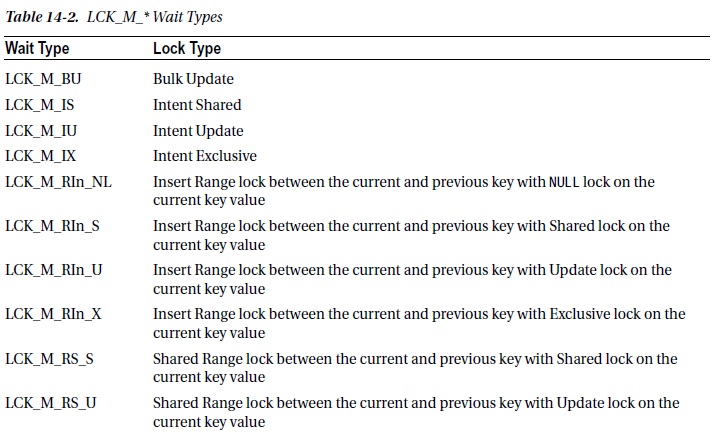

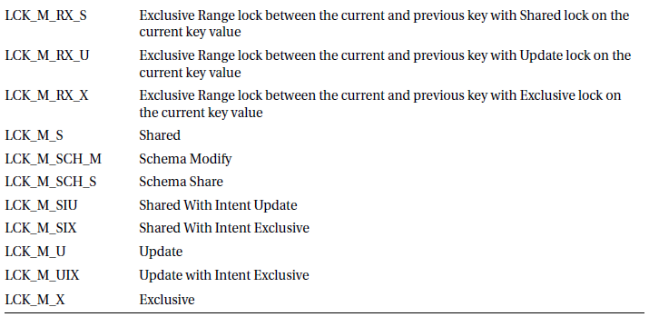

### PAGEIOLATCH_*

The final index-related wait is PAGEIOLATCH\_\* wait types. This wait refers to the waits that occur when SQL Server is retrieving data pages from indexes and placing them into memory. The time in which the query is ready to retrieve the data pages and when they are available in memory is tracked by SQL Server with these counters. As with LCK_M_* waits, there are a number of different PAGEIOLATCH\_\*, which are defined in Table 14-3.

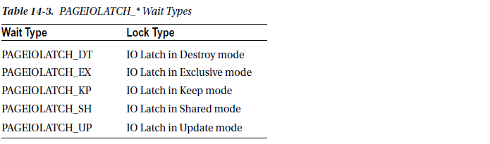

First, monitor the indexes that are currently in the buffer cache to identify which indexes are available. Also, review the **Page Life Expectancy/sec (PLE)** counter, which is not currently collected in the monitoring section. Reviewing the allocation of pages to indexes in the buffer before and after changes in the PLE can help identify which indexes are pushing information out of memory. Then investigate query plans and tune the queries or indexes to reduce the amount of data needed to satisfy the queries.

The second tactic to addressing PAGEIOLATCH_* is to put more emphasis on the **Full Scans/sec** analysis. Often, indexes that lead to increases in this wait type are related to full scans that are in use by the database. By placing more emphasis on reducing the need for full scans in execution plans, less data will need to be pulled into memory, leading to a decrease in this wait type.

In some cases, the issues related to PAGEIOLATCH_* are unrelated to indexing. The issue can simply be a matter of slow disk performance. To verify whether this is the case, monitor the performance of the server counters for **Physical disk: disk seconds/read** and **Physical disk: disk seconds/write** and the **virtual file stats** for SQL Server. If these statistics are continually high, expand the investigation outside of indexing to hardware and the I/O storage level. Besides improving disk performance, this wait statistic can be reduced by increasing the available memory, which can decrease the likelihood that the data page will be pushed out of memory.

## Buffer Allocation

The final area to look at when determining the server state with indexing is to look at the data pages that are in the buffer cache. This isn’t a typical area that people usually look at when considering indexing, but it provides a wealth of information regarding what SQL Server is putting into memory. The basic question that this can answer for the SQL Server instance is, does the data in the buffer represent the data most important to the applications using the SQL Server?

The first part of answering this question is to review which databases have how many pages in memory. This might not seem that important, but the amount of memory being used by the different databases can sometimes be surprising. Before indexes were added to the backup tables in the MSDB database, it wouldn’t be uncommon for those tables to push all the data in the backup tables into memory. If the data in the tables wasn’t trimmed often, this could be a lot of information not critical to the business applications consuming an unnecessary amount of data.

For the second part of the question, you will need to engage the owners and subject-matter experts for the applications using the SQL Server instance. If the answers from these folks don’t match the information that is in the buffer, this provides a list of databases for which you can focus the index-tuning effort.

Along those same lines, many applications have logging databases where error and processing events are stored for troubleshooting at a later date. When issues arise, instead of going to log files, the developers can simply query the database and extract the events they need to perform their troubleshooting. But what if these tables aren’t properly indexed or the queries aren’t SARGable? Log tables with millions or billions of rows may be pushed into memory, pushing the data from the line-of-business applications out of memory and potentially causing worse issues.

If the data in the buffer isn’t being checked, there is no way to know what is in memory and if it is the right stuff.

Checking the data in memory is a relatively simple task that utilizes the DMO `sys.dm_os_buffer_descriptors`. This DMO lists each data page that is in memory and describes the information on the page. By counting each page for each database, the total number of pages and the size of memory allocated to the database can be determined. Using the query in Listing 14-27, you can see in Figure 14-11 that the ***AdventureWorks*** database occupies the most memory on the server with the ***IndexingMethod*** database currently using 7.63MB of space.

```sql
-- Listing 14-27. Buffer Allocation for Each Database
SELECT LEFT(CASE database_id
                WHEN 32767 THEN 'ResourceDb'
                ELSE DB_NAME (database_id)
            END, 20) AS "Database_Name",
       COUNT (*) AS "Buffered_Page_Count",
       CAST(COUNT (*) * 8 / 1024.0 AS NUMERIC(10, 2)) AS "Buffer_Pool_MB"
FROM sys.dm_os_buffer_descriptors
GROUP BY DB_NAME (database_id),
         database_id
ORDER BY Buffered_Page_Count DESC;
```

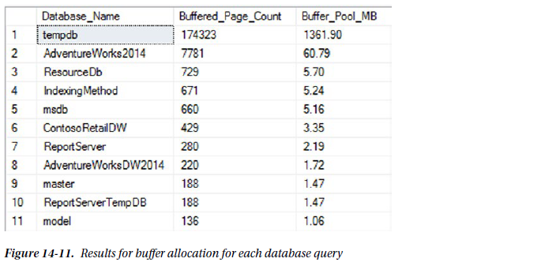

Once the databases in memory have been identified, it is also useful to determine what objects in the database are in memory. For the similar reason as looking to see what databases are in memory, identifying the objects in memory helps with identifying the tables and indexes to focus on when indexing. Retrieving the memory use per table and index also utilizes `sys.dm_os_buffer_descriptors` but includes mapping the rows to *allocation_unit_id* values in the catalog views `sys.allocation_units` and `sys.partitions`.

Through the query in Listing 14-28, the memory used by each of the user tables and indexes is returned. In the results in Figure 14-12, the table ***BigTable*** is taking up a substantial amount of memory. If you are familiar with this database, you know that the table isn’t one that is part of this database. This can lead you to other questions, such as where did it come from? Why is it so large? Is the space used by the table impacting the ability of other databases to use memory optimally with their indexes? In these cases, you need to investigate the indexes on these tables because the tables that are most in memory ought to have the best-honed indexing profiles.

```sql
-- Listing 14-28. Buffer Allocation by Table/Index
WITH BufferAllocation AS
(
    SELECT object_id,
           index_id,
           allocation_unit_id
    FROM sys.allocation_units AS au
    INNER JOIN sys.partitions AS p
        ON au.container_id = p.hobt_id
           AND (au.type = 1 OR au.type = 3)
    UNION ALL
    SELECT object_id,
           index_id,
           allocation_unit_id
    FROM sys.allocation_units AS au
    INNER JOIN sys.partitions AS p
        ON au.container_id = p.hobt_id
           AND au.type = 2
)
SELECT t.name,
       i.name,
       i.type_desc,
       COUNT (*) AS "Buffered_Page_Count",
       CAST(COUNT (*) * 8 / 1024.0 AS NUMERIC(10, 2)) AS "Buffer_MB"
FROM sys.tables AS t
INNER JOIN BufferAllocation AS ba
    ON t.object_id = ba.object_id
LEFT JOIN sys.indexes AS i
    ON ba.object_id = i.object_id
       AND ba.index_id = i.index_id
INNER JOIN sys.dm_os_buffer_descriptors AS bd
    ON ba.allocation_unit_id = bd.allocation_unit_id
WHERE bd.database_id = DB_ID ()
GROUP BY t.name,
         i.index_id,
         i.name,
         i.type_desc
ORDER BY Buffered_Page_Count DESC;
```

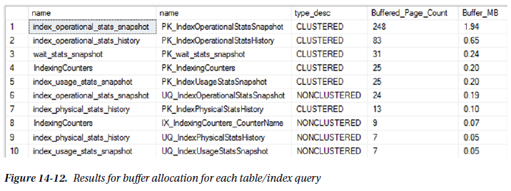

# Schema Discovery

After investigating the state of the server and its indexing needs, the next step in the index analysis process is to investigate the schema of the databases to determine whether there are schema-related indexing issues that can be addressed. For these issues, you are primarily going to focus on a few key details that can be discovered through catalog views.

## Identify Heaps

When heaps are preferred, it should be when the use of a clustered index has been shown to negatively impact performance as opposed to a heap. When investigating heaps, it is best to consider the number of rows and the utilization of the heap. When a heap has a low number of rows or is not being used, taking the effort to cluster its table may be rather pointless.

To identify heaps, use the catalog views `sys.indexes` and `sys.partitions`. The performance information is available in the table ***dbo.index_usage_stats_history***. It can be used in conjunction to form the query in Listing 14-29, which provides the output in Figure 14-13.

```sql
-- Listing 14-29. Query to Identify Heaps
SELECT QUOTENAME (DB_NAME ()) AS "database_name",
       QUOTENAME (OBJECT_SCHEMA_NAME (i.object_id)) + '.' + QUOTENAME (OBJECT_NAME (i.object_id)) AS "object_name",
       i.index_id,
       p.rows,
       SUM (h.user_seeks) AS "user_seeks",
       SUM (h.user_scans) AS "user_scans",
       SUM (h.user_lookups) AS "user_lookups",
       SUM (h.user_updates) AS "user_updates"
FROM sys.indexes AS i
INNER JOIN sys.partitions AS p
    ON i.index_id = p.index_id
       AND i.object_id = p.object_id
LEFT OUTER JOIN IndexingMethod.dbo.index_usage_stats_history AS h
    ON p.object_id = h.object_id
       AND p.index_id = h.index_id
WHERE type_desc = 'HEAP'
GROUP BY i.index_id,
         p.rows,
         i.object_id
ORDER BY p.rows DESC;
```

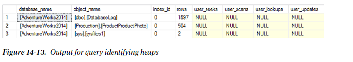

The results show that ***dbo.DatabaseLog*** has a number of rows. The next step is to review the schema of the table. If there is a primary key already on the table, it’s a good candidate for the clustering index key. If not, check for another key column, such as a business key. If there is no key column, it may be worthwhile to add a surrogate key to the table.

## Duplicate Indexes

Except for rare occasions, there is no need to have duplicate indexes in your databases. They waste space and cost resources to maintain without providing any benefit. To determine that an index is a duplicate of another, review the key columns and included columns of the index. If these match, the index is considered a duplicate.

To uncover duplicate indexes, the `sys.indexes` view is used in conjunction with the `sys.index_columns` catalog view. Comparing these views to each other using the code in Listing 14-30 will provide a list of the indexes that are duplicates. The results from the query, displayed in Figure 14-14, show that in the ***AdventureWorks*** database the indexes ***AK_Document_rowguid*** and ***UQDocumentF73921F7B9BAB8A8*** are duplicates.

```sql
-- Listing 14-30. Query to Identify Duplicate Indexes
USE AdventureWorks;
GO

WITH IndexSchema AS
(
    SELECT i.object_id,
           i.index_id,
           i.name,
           ISNULL (i.filter_definition, '') AS "filter_definition",
           i.is_unique,
           (
               SELECT QUOTENAME (CAST(ic.column_id AS VARCHAR(10)) + CASE
                                                                         WHEN ic.is_descending_key = 1 THEN '-'
                                                                         ELSE '+'
                                                                     END,
                                 '('
                      )
               FROM sys.index_columns AS ic
               INNER JOIN sys.columns AS c
                   ON ic.object_id = c.object_id
                      AND ic.column_id = c.column_id
               WHERE i.object_id = ic.object_id
                     AND i.index_id = ic.index_id
                     AND is_included_column = 0
               ORDER BY key_ordinal ASC
               FOR XML PATH ('')
           ) + COALESCE ((
                   SELECT QUOTENAME (CAST(ic.column_id AS VARCHAR(10)) + CASE
                                                                             WHEN ic.is_descending_key = 1 THEN '-'
                                                                             ELSE '+'
                                                                         END,
                                     '('
                          )
                   FROM sys.index_columns AS ic
                   INNER JOIN sys.columns AS c
                       ON ic.object_id = c.object_id
                          AND ic.column_id = c.column_id
                   LEFT OUTER JOIN sys.index_columns AS ic_key
                       ON c.object_id = ic_key.object_id
                          AND c.column_id = ic_key.column_id
                          AND i.index_id = ic_key.index_id
                          AND ic_key.is_included_column = 0
                   WHERE i.object_id = ic.object_id
                         AND ic.index_id = 1
                         AND ic.is_included_column = 0
                         AND ic_key.index_id IS NULL
                   ORDER BY ic.key_ordinal ASC
                   FOR XML PATH ('')
               ),
                         ''
               ) + CASE
                       WHEN i.is_unique = 1 THEN 'U'
                       ELSE ''
                   END AS "index_columns_keys_ids",
           CASE
               WHEN i.index_id IN ( 0, 1 ) THEN 'ALL-COLUMNS'
               ELSE COALESCE ((
                        SELECT QUOTENAME (ic.column_id, '(')
                        FROM sys.index_columns AS ic
                        INNER JOIN sys.columns AS c
                            ON ic.object_id = c.object_id
                               AND ic.column_id = c.column_id
                        LEFT OUTER JOIN sys.index_columns AS ic_key
                            ON c.object_id = ic_key.object_id
                               AND c.column_id = ic_key.column_id
                               AND ic_key.index_id = 1
                        WHERE i.object_id = ic.object_id
                              AND i.index_id = ic.index_id
                              AND ic.is_included_column = 1
                              AND ic_key.index_id IS NULL
                        ORDER BY ic.key_ordinal ASC
                        FOR XML PATH ('')
                    ),
                              SPACE (0)
                    )
           END AS "included_columns_ids"
    FROM sys.tables AS t
    INNER JOIN sys.indexes AS i
        ON t.object_id = i.object_id
    INNER JOIN sys.data_spaces AS ds
        ON i.data_space_id = ds.data_space_id
    INNER JOIN sys.dm_db_partition_stats AS ps
        ON i.object_id = ps.object_id
           AND i.index_id = ps.index_id
)
SELECT QUOTENAME (DB_NAME ()) AS "database_name",
       QUOTENAME (OBJECT_SCHEMA_NAME (is1.object_id)) + '.' + QUOTENAME (OBJECT_NAME (is1.object_id)) AS "object_name",
       is1.name AS "index_name",
       is2.name AS "duplicate_index_name"
FROM IndexSchema AS is1
INNER JOIN IndexSchema AS is2
    ON is1.object_id = is2.object_id
       AND is1.index_id <> is2.index_id
       AND is1.index_columns_keys_ids = is2.index_columns_keys_ids
       AND is1.included_columns_ids = is2.included_columns_ids
       AND is1.filter_definition = is2.filter_definition
       AND is1.is_unique = is2.is_unique;
```

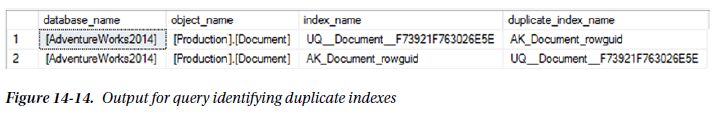

When duplicates are found, one of the two indexes should be removed from the database. While one of the indexes will have index activity, removing either will shift the activity from one to the other. Before removing either index, review the non-column properties of the index to make sure important aspects of the index are not lost. For instance, if one of the indexes is designated as unique, be sure that the index retained still has that property.

## Overlapping Indexes

An index is considered to be overlapping another index when its key columns make up all or part of another index’s key columns. Included columns are not considered when looking at overlapping columns; the focus for this evaluation is only on the key columns.

To identify overlapping indexes, the same catalog views, `sys.indexes` and `sys.index_columns`, are used. For each index, its key columns will be compared using the `LIKE` operator and a wildcard to the key columns of the other indexes on the table. When there is a match, it will be flagged as an overlapping index. The query for this check is provided in Listing 14-31, with the results from executing against the ***AdventureWorks*** database shown in Figure 14-15.

```sql
-- Listing 14-31. Query to Identify Overlapping Indexes
WITH IndexSchema AS
(
    SELECT i.object_id,
           i.index_id,
           i.name,
           (
               SELECT CASE key_ordinal
                          WHEN 0 THEN NULL
                          ELSE QUOTENAME (column_id, '(')
                      END
               FROM sys.index_columns AS ic
               WHERE ic.object_id = i.object_id
                     AND ic.index_id = i.index_id
               ORDER BY key_ordinal,
                        column_id
               FOR XML PATH ('')
           ) AS "index_columns_keys"
    FROM sys.tables AS t
    INNER JOIN sys.indexes AS i
        ON t.object_id = i.object_id
    WHERE i.type_desc IN ( 'CLUSTERED', 'NONCLUSTERED', 'HEAP' )
)
SELECT QUOTENAME (DB_NAME ()) AS "database_name",
       QUOTENAME (OBJECT_SCHEMA_NAME (is1.object_id)) + '.' + QUOTENAME (OBJECT_NAME (is1.object_id)) AS "object_name",
       STUFF ((
                  SELECT ', ' + c.name
                  FROM sys.index_columns AS ic
                  INNER JOIN sys.columns AS c
                      ON ic.object_id = c.object_id
                         AND ic.column_id = c.column_id
                  WHERE ic.object_id = is1.object_id
                        AND ic.index_id = is1.index_id
                  ORDER BY ic.key_ordinal,
                           ic.column_id
                  FOR XML PATH ('')
              ),
              1,
              2,
              ''
       ) AS "index_columns",
       STUFF ((
                  SELECT ', ' + c.name
                  FROM sys.index_columns AS ic
                  INNER JOIN sys.columns AS c
                      ON ic.object_id = c.object_id
                         AND ic.column_id = c.column_id
                  WHERE ic.object_id = is1.object_id
                        AND ic.index_id = is1.index_id
                        AND ic.is_included_column = 1
                  ORDER BY ic.column_id
                  FOR XML PATH ('')
              ),
              1,
              2,
              ''
       ) AS "included_columns",
       is1.name AS "index_name",
       SUM (
           CASE
               WHEN is1.index_id = h.index_id THEN
                   ISNULL (h.user_seeks, 0) + ISNULL (h.user_scans, 0) + ISNULL (h.user_lookups, 0)
                   + ISNULL (h.user_updates, 0)
           END
       ) AS "index_activity",
       is2.name AS "duplicate_index_name",
       SUM (
           CASE
               WHEN is2.index_id = h.index_id THEN
                   ISNULL (h.user_seeks, 0) + ISNULL (h.user_scans, 0) + ISNULL (h.user_lookups, 0)
                   + ISNULL (h.user_updates, 0)
           END
       ) AS "duplicate_index_activity"
FROM IndexSchema AS is1
INNER JOIN IndexSchema AS is2
    ON is1.object_id = is2.object_id
       AND is1.index_id > is2.index_id
       AND (
           is1.index_columns_keys LIKE is2.index_columns_keys + '%'
           AND is2.index_columns_keys LIKE is2.index_columns_keys + '%'
       )
LEFT OUTER JOIN IndexingMethod.dbo.index_usage_stats_history AS h
    ON is1.object_id = h.object_id
GROUP BY is1.object_id,
         is1.name,
         is2.name,
         is1.index_id;
```

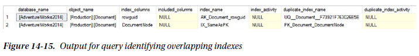

Decisions on handling overlapping indexes are not as cut and dry as the duplicate indexes. To help illustrate overlapping indexes, the index ***IX_SameAsPK*** was creating on the column *DocumentNode*. This is the same column that is used as the clustering key for the table ***Production.Document***. What this example shows, though, is that a nonclustered index can be considered an overlapping index of a clustered index. In some cases, it might be advisable to remove the overlapping nonclustered index. In all reality, the clustered index has the same key, and the pages are sorted in the same manner. You can find the same values in both. The grey area comes in when considering the size of the rows in the clustered index. If the rows are wide enough, if just querying for the clustering key, it will at times be more beneficial to use the nonclustered index. In this manner, you will need to spend more time analysing indexes. This same grey area will apply to comparisons between two nonclustered indexes as well.

When reviewing overlapping indexes, there are a few other things to note. Be sure to retain the index properties, such as whether the index is unique. Also, watch the included columns. The included columns are not considered in the overlapping comparison. There may be unique sets of included columns between the two indexes. Watch for this and merge the included columns as appropriate.

## Unindexed Foreign Keys

Foreign keys are useful for enforcing constraints within a database. When there are parent and child relationships between tables, foreign keys provide the mechanism to verify that child tables aren’t referencing parent values that don’t exist. Likewise, the foreign key makes certain that a parent value can’t be removed while child values are still in use. To support these validations, the columns for the parent and child values between the tables need to be indexed. If one or the other is not indexed, SQL Server can’t optimize the operation with a seek and is forced to use a scan to verify that the values are not in the related table.

Verifying that foreign keys are indexed involves a process similar to the duplicate and overlapping indexes process. Along with the `sys.indexes` and `sys.index_columns` catalog views, the `sys.foreign_key_columns` view is used to provide an index template that the foreign key would rely upon. This is pulled together in the query in Listing 14-32 with results from the ***AdventureWorks*** database shown in Figure 14-16.

```sql
-- Listing 14-32. Query to Identify Unindexed Foreign Keys
WITH cIndexes AS
(
    SELECT i.object_id,
           i.name,
           (
               SELECT QUOTENAME (ic.column_id, '(')
               FROM sys.index_columns AS ic
               WHERE i.object_id = ic.object_id
                     AND i.index_id = ic.index_id
                     AND is_included_column = 0
               ORDER BY key_ordinal ASC
               FOR XML PATH ('')
           ) AS "indexed_compare"
    FROM sys.indexes AS i
),
     cForeignKeys AS
(
    SELECT fk.name AS "foreign_key_name",
           'PARENT' AS "foreign_key_type",
           fkc.parent_object_id AS "object_id",
           STUFF ((
                      SELECT ', ' + QUOTENAME (c.name)
                      FROM sys.foreign_key_columns AS ifkc
                      INNER JOIN sys.columns AS c
                          ON ifkc.parent_object_id = c.object_id
                             AND ifkc.parent_column_id = c.column_id
                      WHERE fk.object_id = ifkc.constraint_object_id
                      ORDER BY ifkc.constraint_column_id
                      FOR XML PATH ('')
                  ),
                  1,
                  2,
                  ''
           ) AS "fk_columns",
           (
               SELECT QUOTENAME (ifkc.parent_column_id, '(')
               FROM sys.foreign_key_columns AS ifkc
               WHERE fk.object_id = ifkc.constraint_object_id
               ORDER BY ifkc.constraint_column_id
               FOR XML PATH ('')
           ) AS "fk_columns_compare"
    FROM sys.foreign_keys AS fk
    INNER JOIN sys.foreign_key_columns AS fkc
        ON fk.object_id = fkc.constraint_object_id
    WHERE fkc.constraint_column_id = 1
),
     cRowCount AS
(
    SELECT object_id,
           SUM (row_count) AS "row_count"
    FROM sys.dm_db_partition_stats AS ps
    WHERE index_id IN ( 1, 0 )
    GROUP BY object_id
)
SELECT QUOTENAME (DB_NAME ()),
       QUOTENAME (OBJECT_SCHEMA_NAME (fk.object_id)) + '.' + QUOTENAME (OBJECT_NAME (fk.object_id)) AS "ObjectName",
       fk.foreign_key_name,
       fk_columns,
       row_count
FROM cForeignKeys AS fk
INNER JOIN cRowCount AS rc
    ON fk.object_id = rc.object_id
LEFT OUTER JOIN cIndexes AS i
    ON fk.object_id = i.object_id
       AND i.indexed_compare LIKE fk.fk_columns_compare + '%'
WHERE i.name IS NULL
ORDER BY row_count DESC,
         OBJECT_NAME (fk.object_id),
         fk.fk_columns;
```

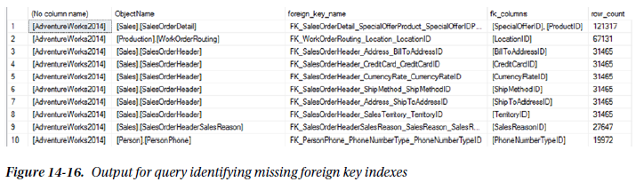

The common practice is that every foreign key should be indexed, always. This, though, is not actually the case for every foreign key. There are a couple things to consider before adding the index. First, how many rows are in the child table? If the row count is low, adding the index may not provide a performance gain. If the uniqueness of the column is fairly low, statistics may justify a scan of every row regardless of the index. In these cases, it could be argued that if the size of the table is small, the cost of the index is also small and there is nothing to lose from adding the index. The other consideration is whether data will be deleted from the table and when activities that require validation of the foreign key will occur. With large tables with many columns and foreign keys, performance may suffer from having yet another index to maintain on the table. The index would probably be of value, but is it of enough value to justify creating it?

While those are good considerations when indexing foreign keys, the majority of the time you will want to index your foreign keys. Similar to the recommendation for clustering tables, index your foreign keys unless you have performance documentation showing that indexing the foreign keys negatively impacts performance.

# Database Engine Tuning Advisor

While tuning queries is often a process of reviewing statistics and evaluating execution plans, the DTA provides means to accelerate this analysis by using the trace files from the monitoring process in the previous chapter to identify potentially useful indexing recommendations. This process is able to accomplish the tuning with minimal impact on the production environment since all the recommendations are derived from analysis on a nonproduction environment.

The basic process for using the DTA index analysis can be broken out into five different steps, shown in Figure 14-17.

1. Collect a workload
2. Gather the metadata
3. Perform the tuning
4. Consider recommendations and review
5. Deploy changes

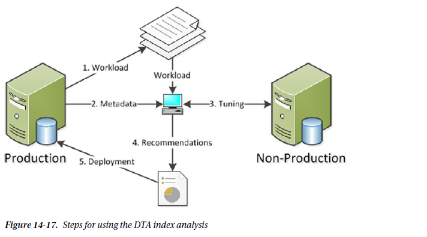

Through this process, you can get a jump-start on indexing and begin working with recommendations that relate to existing performance issues.

The first step in the process is to collect a workload. If you followed the process in the index monitoring process, you should have already collected this information. There are two standard scenarios that workloads should represent. To begin, collect a workload that represents a typical day, because even a normal day can have underlying performance issues that tuning can help alleviate. Second, gather a workload during times where performance problems are known to exist. This will be useful for providing recommendations that you may be able to achieve through manual tuning.

After the workload is collected, the next step is to gather the necessary metadata to start the tuning sessions. There are two components to gathering metadata. The first is to create an XML input file for the dta session. The XML input file contains the production and nonproduction server names and information on where the workload is and what type of tuning options to utilize (Listing 14-33 shows a sample). For more information on tuning options, see Chapter 7. The second part of this step is the effect on tuning from the first piece. When the tuning occurs, SQL Server will gather the schema and statistics for the database from the production database(s) and move that information to the nonproduction server. While the database won’t have the production data, it will have the information necessary to make indexing recommendations.

```xml
<!-- Listing 14-33. Sample XML Input File for DTA -->
<?xml version="1.0" encoding="utf-16" ?>
<DTAXML xmlns:xsi="http://www.w3.org/2001/XMLSchema-instance" xmlns="http://schemas.
microsoft.com/sqlserver/2004/07/dta">
	<DTAInput>
		<Server>
			<Name>STR8-SQL-PRD</Name>
			<Database>
				<Name>AdventureWorks2014</Name>
			</Database>
		</Server>
		<Workload>
			<File>c:\temp\IndexingMethod.trc</File>
			<File>c:\temp\IndexingMethod_1.trc</File>
		</Workload>
		<TuningOptions>
			<TestServer> STR8-SQL-TEST </TestServer>
			<FeatureSet>IDX</FeatureSet>
			<Partitioning>NONE</Partitioning>
			<KeepExisting>NONE</KeepExisting>
		</TuningOptions>
	</DTAInput>
</DTAXML>
```

> **Note**
>
> You can find more information on the XML input file configuration in Books Online at http://technet.microsoft.com/en-us/library/ms173513.aspx.

The next step is the actual execution of the DTA tuning session. To run the session, execute the dta command using the -ix command-line option, shown in Listing 14-34. Since all the configuration information for the session is located in the XML file, there is no need to add any additional parameters.

```bash
# Listing 14-34. DTA Command with XML Input File
dta -ix "c:\temp\SessionConfig.xml"
```

After the tuning session completes, you will receive a list of index recommendations. This isn’t the last step in this portion of the process. Before any recommendations from the DTA can be implemented, they must be reviewed. While using this tool will accelerate the index analysis process, all the recommendations need to be reviewed and vetted to verify that they make sense and don’t overload a table with more indexes than SQL Server can support for the workload.

The last step is to deploy the indexing recommendations. This step is technically outside the scope of this phase of the indexing method. At this time, though, you should be familiar with the indexing changes that will be implemented. Add these changes to the existing list of indexing changes from other analysis and prepare them for implementation.

# Unused Indexes

One of the necessary and potentially dangerous steps during index analysis is the determination of indexes to remove. Some indexes will be removed because of consolidation or because they are duplicates. Often these have less risk than when other indexes are dropped. The indexes in this other category are those that are unused.

The easiest manner for identifying indexes that are not used is to check the list of indexes in each database against the ***dbo.index_usage_stats_history table*** in the ***IndexingMethod*** database. If there are any unused indexes in the database, the query in Listing 14-35 will identify them. One word of caution with unused indexes: in this analysis, heaps and clustered indexes are ignored, along with any unique indexes and primary keys. Indexes with these properties are often related to other business rules, and their removal should be based on other factors. Figure 14-18 shows an example of unused indexes in the **AdventureWorks** database.

```sql
-- Listing 14-35. Query for Unused Indexes
SELECT OBJECT_NAME (i.object_id) AS "table_name",
       COALESCE (i.name, SPACE (0)) AS "index_name",
       ps.partition_number,
       ps.row_count,
       CAST((ps.reserved_page_count * 8) / 1024. AS DECIMAL(12, 2)) AS "size_in_mb",
       COALESCE (ius.user_seeks, 0) AS "user_seeks",
       COALESCE (ius.user_scans, 0) AS "user_scans",
       COALESCE (ius.user_lookups, 0) AS "user_lookups",
       i.type_desc
FROM sys.all_objects AS t
INNER JOIN sys.indexes AS i
    ON t.object_id = i.object_id
INNER JOIN sys.dm_db_partition_stats AS ps
    ON i.object_id = ps.object_id
       AND i.index_id = ps.index_id
LEFT OUTER JOIN sys.dm_db_index_usage_stats AS ius
    ON ius.database_id = DB_ID ()
       AND i.object_id = ius.object_id
       AND i.index_id = ius.index_id
WHERE i.type_desc NOT IN ( 'HEAP', 'CLUSTERED' )
      AND i.is_unique = 0
      AND i.is_primary_key = 0
      AND i.is_unique_constraint = 0
      AND COALESCE (ius.user_seeks, 0) <= 0
      AND COALESCE (ius.user_scans, 0) <= 0
      AND COALESCE (ius.user_lookups, 0) <= 0
ORDER BY OBJECT_NAME (i.object_id),
         i.name;
```

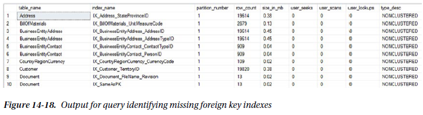

There are two additional scenarios for identifying unused indexes. These are lightly used indexes or no longer used indexes. A similar process can be used for these situations: instead of looking for indexes that have never been used, filter for low usage rates or no use in a period of weeks or months. But don’t just remove these indexes automatically. If the index is lightly used, verify how the index is being used before dropping it. It may be used once a day, but it might be tied to critical processes. Also, with no longer used indexes, verify that the index isn’t part of a seasonal process. Removing indexes tied to seasonal activity can create more of a burden than just maintaining them in off-peak times.

# Index Plan Usage

While statistics can show that there was a seek or a scan against an index, it doesn’t provide you with enough detail to know what columns to add or what caused the index to use a scan over a seek. To gather this information, you need to turn to the execution plan. And the place where you can get some of the best execution plans for your databases and SQL Server instance is the plan cache. For index analysis, you’ll be looking at two queries that can be used to retrieve execution plans from the plan cache.

The first query is one that will be used when you need to retrieve all the plans for a specific index. Suppose you need to determine what processes, or T-SQL statements, are using one of the indexes on a table that is used once or twice a day. For this, you can turn to the plan cache with the query in Listing 14-36 and check whether the plan for that query is still in the cache. To use the query, replace the index name in the variable `@IndexName` and execute it to return a list of plans that use the index. Be cautious if you have a database where there are many indexes with the same name, since index names need to be unique only on a per-table basis. If all of the indexes are named *IX_1* and *IX_2*, you will need to verify the table name in the search to be sure you have the correct index.

```sql
-- Listing 14-36. Query Plan Cache for Index Usage
SET TRANSACTION ISOLATION LEVEL READ UNCOMMITTED;
GO

DECLARE @IndexName sysname = 'PK_SalesOrderHeader_SalesOrderID';
SET @IndexName = QUOTENAME (@IndexName, '[');

WITH XMLNAMESPACES (DEFAULT 'http://schemas.microsoft.com/sqlserver/2004/07/showplan')
, IndexSearch AS
(
    SELECT qp.query_plan,
           cp.usecounts,
           ix.query ('.') AS "StmtSimple"
    FROM sys.dm_exec_cached_plans AS cp
    OUTER APPLY sys.dm_exec_query_plan (cp.plan_handle) AS qp
    CROSS APPLY qp.query_plan.nodes ('//StmtSimple') AS p(ix)
    WHERE query_plan.exist ('//Object[@Index = sql:variable("@IndexName")]') = 1
)
SELECT StmtSimple.value ('StmtSimple[1]/@StatementText', 'VARCHAR(4000)') AS "sql_text",
       obj.value ('@Database', 'sysname') AS "database_name",
       obj.value ('@Schema', 'sysname') AS "schema_name",
       obj.value ('@Table', 'sysname') AS "table_name",
       obj.value ('@Index', 'sysname') AS "index_name",
       ixs.query_plan
FROM IndexSearch AS ixs
CROSS APPLY StmtSimple.nodes ('//Object') AS o(obj)
WHERE obj.exist ('//Object[@Index = sql:variable("@IndexName")]') = 1;
```

At other times, searching for just the name of an index will be too broad of a search of the plan cache. In these cases, you can use the query in Listing 14-37. This query adds in the name of a physical operator to the plan cache search. For instance, suppose you are investigating Full Scans/sec and you know what index is causing the spike in the performance counter. Searching for just the index may return dozens of execution plans. Alternatively, you could add a search for a particular operator, such as an index scan, using the `@op` variable in the query provided.

```sql
-- Listing 14-37. Query Plan Cache for Index Usage and Physical Operation
DECLARE @IndexName sysname = 'IX_SalesOrderHeader_SalesPersonID';
DECLARE @op sysname = 'Index Scan';

;WITH XMLNAMESPACES (DEFAULT N'http://schemas.microsoft.com/sqlserver/2004/07/showplan')
SELECT cp.plan_handle,
       DB_NAME (dbid) + '.' + OBJECT_SCHEMA_NAME (objectid, dbid) + '.' + OBJECT_NAME (objectid, dbid) AS "database_object",
       qp.query_plan,
       c1.value ('@PhysicalOp', 'nvarchar(50)'),
       c2.value ('@Index', 'nvarchar(max)')
FROM sys.dm_exec_cached_plans AS cp
CROSS APPLY sys.dm_exec_query_plan (cp.plan_handle) AS qp
CROSS APPLY query_plan.nodes ('//RelOp') AS r(c1)
OUTER APPLY c1.nodes ('IndexScan/Object') AS o(c2)
WHERE c2.value ('@Index', 'nvarchar(max)') = QUOTENAME (@IndexName, '[')
      AND c1.exist ('@PhysicalOp[. = sql:variable("@op")]') = 1;
```

Both of these queries provide mechanisms for getting in and investigating indexes in their environment and seeing exactly how SQL Server is using them. This information can be easily leveraged to identify when problems are occurring and why and then provide a path to resolving indexing issues without a lot of the guesswork that many use today.

