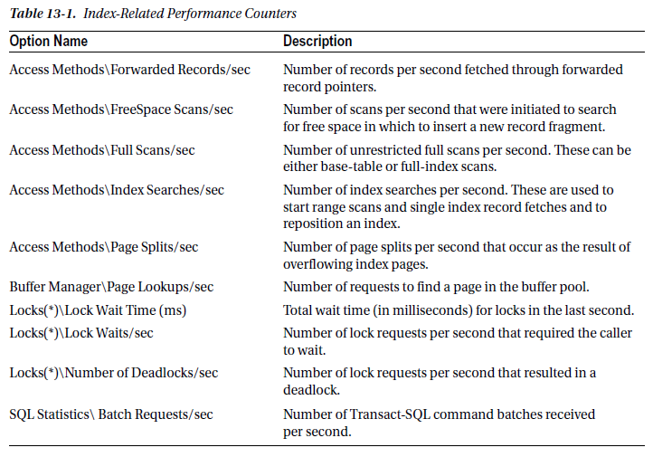
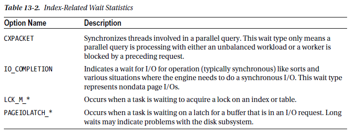
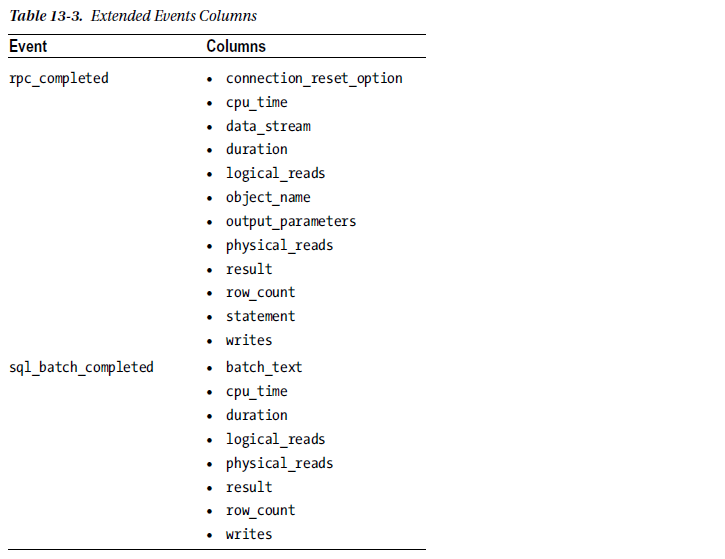

[TOC]

# Performance Counters

Performance counters are metrics provided by Microsoft to measure the rate of events or state of resources within applications and hardware on the server. With some of the performance counters, there are general guidelines that can be used to indicate when a problem with indexing may exist. For the others, changes in the rate or level of the performance counter may indicate a need to change the indexing on a server.

The primary issue with using performance counters is that they represent the server-level, or SQL Server instance–level, state of the counters. They do not indicate at a database or table level where possible indexing issues may be occurring. This level of detail, though, is acceptable and useful when considering the other tools available for monitoring your indexing and identifying potential indexing needs. One advantage to collecting counter information at this level is that you are forced to consider the whole picture and the effect of all the indexes on performance. In an isolated situation, a couple of poorly performing indexes on a table might be acceptable. However, in conjunction with a few tables with poor indexes, the aggregate performance may reach a tipping point where the indexes need to be addressed. With the server-level statistics provided by performance counters, you will be able to identify when this point has been reached.

There are a large number of performance counters available for both SQL Server and Windows Server. From the perspective of indexing, though, many of the performance counters can be eliminated. The performance counters that are most useful are those that map to operations related to how indexes operate or are accessed, such as forwarded records and index searches. For a definition of the performance counters that are most useful with indexing, see Table 13-1.



There are a number of ways to collect performance counters. For the monitoring in this chapter, you’ll use the DMV `sys.dm_os_performance_counters`. This DMV returns a row for all the SQL Server counters for an instance. The values returned are the raw values for the counters, so depending on the type of counter, the value can be a point-in-time state value or an ever-accumulating aggregate.

To begin collecting performance counter information for monitoring, you’ll first need to create a table for storing this information. The table definition in Listing 13-1 provides for this need. When collecting the performance counters, you will use a table that stores the counter name with the value and then datestamps each row to identify when the information was collected.

```sql
-- Listing 13-1. Performance Counter Snapshot Table
USE IndexingMethod;
GO

CREATE TABLE dbo.IndexingCounters (
    counter_id               INT          IDENTITY(1, 1),
    create_date              DATETIME,
    server_name              VARCHAR(128) NOT NULL,
    object_name              VARCHAR(128) NOT NULL,
    counter_name             VARCHAR(128) NOT NULL,
    instance_name            VARCHAR(128) NULL,
    Calculated_Counter_value FLOAT        NULL,
    CONSTRAINT PK_IndexingCounters
        PRIMARY KEY CLUSTERED (counter_id)
);
GO

CREATE NONCLUSTERED INDEX IX_IndexingCounters_CounterName
ON dbo.IndexingCounters (counter_name)
INCLUDE (create_date, server_name, object_name, Calculated_Counter_value);
```

For the purposes of collecting information for monitoring indexing, you’ll take the information from `sys.dm_os_performance_counters` and calculate the appropriate values from the DMV. These would be the same values that are available when viewing performance counter information from other tools, such as Performance Monitor. There are a few steps required to populate ***dbo.IndexingCounters***. As mentioned, the DMV contains raw counter values. To calculate these values properly, it is necessary to take a snapshot of the values in the DMV and then wait a number of seconds before calculating the counter value. In Listing 13-2, the counter value is calculated after ten seconds. Once the time has expired, the counters are calculated and inserted into the ***dbo.IndexingCounters*** tables. This script should be scheduled and executed frequently. Ideally, you should collect this information every one to five minutes.

```sql
-- Listing 13-2. Performance Counter Snapshot Script
USE IndexingMethod;
GO

IF OBJECT_ID ('tempdb..#Baseline') IS NOT NULL 
	DROP TABLE #Baseline;

SELECT GETDATE () AS "sample_time",
       pc1.object_name,
       pc1.counter_name,
       pc1.instance_name,
       pc1.cntr_value,
       pc1.cntr_type,
       x.cntr_value AS "base_cntr_value"
INTO #Baseline
FROM sys.dm_os_performance_counters AS pc1
OUTER APPLY (
    SELECT cntr_value
    FROM sys.dm_os_performance_counters AS pc2
    WHERE pc2.cntr_type = 1073939712
          AND UPPER (pc1.counter_name) = UPPER (pc2.counter_name)
          AND pc1.object_name = pc2.object_name
          AND pc1.instance_name = pc2.instance_name
) AS x
WHERE pc1.cntr_type IN ( 272696576, 1073874176 )
      AND (
          pc1.object_name LIKE '%:Access Methods%'
          AND (
              pc1.counter_name LIKE 'Forwarded Records/sec%'
              OR pc1.counter_name LIKE 'FreeSpace Scans/sec%'
              OR pc1.counter_name LIKE 'Full Scans/sec%'
              OR pc1.counter_name LIKE 'Index Searches/sec%'
              OR pc1.counter_name LIKE 'Page Splits/sec%'
          )
      )
      OR (
          pc1.object_name LIKE '%:Buffer Manager%'
          AND (
              pc1.counter_name LIKE 'Page life expectancy%'
              OR pc1.counter_name LIKE 'Page lookups/sec%'
          )
      )
      OR (
          pc1.object_name LIKE '%:Locks%'
          AND (
              pc1.counter_name LIKE 'Lock Wait Time (ms)%'
              OR pc1.counter_name LIKE 'Lock Waits/sec%'
              OR pc1.counter_name LIKE 'Number of Deadlocks/sec%'
          )
      )
      OR (
          pc1.object_name LIKE '%:SQL Statistics%'
          AND pc1.counter_name LIKE 'Batch Requests/sec%'
      );

WAITFOR DELAY '00:00:10';

INSERT INTO dbo.IndexingCounters (create_date,
                                  server_name,
                                  object_name,
                                  counter_name,
                                  instance_name,
                                  Calculated_Counter_value)
SELECT GETDATE (),
       LEFT(pc1.object_name, CHARINDEX (':', pc1.object_name) - 1),
       SUBSTRING (pc1.object_name, 1 + CHARINDEX (':', pc1.object_name), LEN (pc1.object_name)),
       pc1.counter_name,
       pc1.instance_name,
       CASE
           WHEN pc1.cntr_type = 65792 THEN pc1.cntr_value
           WHEN pc1.cntr_type = 272696576 THEN
               COALESCE ((1. * pc1.cntr_value - x.cntr_value) / NULLIF(DATEDIFF (s, sample_time, GETDATE ()), 0), 0)
           WHEN pc1.cntr_type = 537003264 THEN COALESCE ((1. * pc1.cntr_value) / NULLIF(base.cntr_value, 0), 0)
           WHEN pc1.cntr_type = 1073874176 THEN
               COALESCE (
                   (1. * pc1.cntr_value - x.cntr_value) / NULLIF(base.cntr_value - x.base_cntr_value, 0)
                   / NULLIF(DATEDIFF (s, sample_time, GETDATE ()), 0),
                   0
               )
       END AS "real_cntr_value"
FROM sys.dm_os_performance_counters AS pc1
OUTER APPLY (
    SELECT cntr_value,
           base_cntr_value,
           sample_time
    FROM #Baseline AS b
    WHERE b.object_name = pc1.object_name
          AND b.counter_name = pc1.counter_name
          AND b.instance_name = pc1.instance_name
) AS x
OUTER APPLY (
    SELECT cntr_value
    FROM sys.dm_os_performance_counters AS pc2
    WHERE pc2.cntr_type = 1073939712
          AND UPPER (pc1.counter_name) = UPPER (pc2.counter_name)
          AND pc1.object_name = pc2.object_name
          AND pc1.instance_name = pc2.instance_name
) AS base
WHERE pc1.cntr_type IN ( 65792, 272696576, 537003264, 1073874176 )
      AND (
          pc1.object_name LIKE '%:Access Methods%'
          AND (
              pc1.counter_name LIKE 'Forwarded Records/sec'
              OR pc1.counter_name LIKE 'FreeSpace Scans/sec%'
              OR pc1.counter_name LIKE 'Full Scans/sec%'
              OR pc1.counter_name LIKE 'Index Searches/sec%'
              OR pc1.counter_name LIKE 'Page Splits/sec%'
          )
      )
      OR (
          pc1.object_name LIKE '%:Buffer Manager%'
          AND (
              pc1.counter_name LIKE 'Page life expectancy%'
              OR pc1.counter_name LIKE 'Page lookups/sec%'
          )
      )
      OR (
          pc1.object_name LIKE '%:Locks%'
          AND (
              pc1.counter_name LIKE 'Lock Wait Time (ms)%'
              OR pc1.counter_name LIKE 'Lock Waits/sec%'
              OR pc1.counter_name LIKE 'Number of Deadlocks/sec%'
          )
      )
      OR (
          pc1.object_name LIKE '%:SQL Statistics%'
          AND pc1.counter_name LIKE 'Batch Requests/sec%'
      );
```

The first time you collect performance counters for your indexes, you won’t be able to compare the counters to other reasonable values for your SQL Server. As time goes on, though, you can retain previous performance counter samples to make comparisons. As part of monitoring, you will be responsible for identifying periods in which values for the performance counters represent the typical activity for your environment. To store these values, insert them into a table similar to the one in Listing 13-3. This table has start and end dates to indicate the range that the baseline represents. Also, there are minimum, maximum, average, and standard deviation columns to store values from the collected counters. The minimum and maximum values allow you to understand the range in which the performance counters vary. The average value provides an idea of what the counter value will be when it is “good.” The standard deviation allows you to understand the variability of the counter values. The lower the number, the more frequently the counter values cluster around the average value. Higher values indicate that the counter values vary more frequently and are often nearer to the minimum and maximum values.

```sql
-- Listing 13-3. Performance Counter Baseline Table
USE IndexingMethod;
GO

CREATE TABLE dbo.IndexingCountersBaseline (
    counter_baseline_id              INT          IDENTITY(1, 1),
    start_date                       DATETIME,
    end_date                         DATETIME,
    server_name                      VARCHAR(128) NOT NULL,
    object_name                      VARCHAR(128) NOT NULL,
    counter_name                     VARCHAR(128) NOT NULL,
    instance_name                    VARCHAR(128) NULL,
    minimum_counter_value            FLOAT        NULL,
    maximum_counter_value            FLOAT        NULL,
    average_counter_value            FLOAT        NULL,
    standard_deviation_counter_value FLOAT        NULL,
    CONSTRAINT PK_IndexingCountersBaseline
        PRIMARY KEY CLUSTERED (counter_baseline_id)
);
GO
```

When populating the values into ***dbo.IndexingCountersBaseline***, there are two steps to the population process. 

First, you need to collect a sample from the performance counters that represents a typical week. If there are no typical weeks, pick this week and collect samples for it. Once you have the typical week, the next step is to aggregate the information into the baseline table. Aggregating the information is a matter of summarizing the information in the table ***dbo.IndexingCounters*** for a range of days. In Listing 13-4, the data is from *March 1* to *March 15, 2012*. 

The next step is to validate the baseline. Just because the average for the past week states that the Forwarded Records/sec value is at 100 doesn’t mean that value is good for your baseline. Use your experience with your servers and databases to influence the values in the baseline. Make adjustments to the baseline as needed if there is a recent trend below or above what is normal.

```sql
-- Listing 13-4. Populate Counter Baseline Table
USE IndexingMethod;
GO

DECLARE @StartDate DATETIME = '20150301',
        @EndDate   DATETIME = '20150325';

INSERT INTO dbo.IndexingCountersBaseline (start_date,
                                          end_date,
                                          server_name,
                                          object_name,
                                          counter_name,
                                          instance_name,
                                          minimum_counter_value,
                                          maximum_counter_value,
                                          average_counter_value,
                                          standard_deviation_counter_value)
SELECT MIN (create_date),
       MAX (create_date),
       server_name,
       object_name,
       counter_name,
       instance_name,
       MIN (calculated_Counter_value),
       MAX (calculated_Counter_value),
       AVG (calculated_Counter_value),
       STDEV (calculated_Counter_value)
FROM dbo.IndexingCounters
WHERE create_date BETWEEN @StartDate AND @EndDate
GROUP BY server_name,
         object_name,
         counter_name,
         instance_name;
```

There are other ways to collect and view performance counters for your SQL Server instances. You can use the Windows application Performance Monitor to view performance counters in real time. It can also be used to log performance counters to a binary or text file. You can use the command-line utility *Logman* to interact with Performance Monitor to create data collectors and start and stop them as needed. Also, PowerShell is a possibility for assisting in the collection of performance counters.

All these alternatives are valid options for collecting performance counters on your databases and indexes. The key is that if you want to monitor your indexes, you must collect the information necessary to know when potential indexing issues may arise. Pick a tool that you are comfortable with and start collecting these counters today.

# Dynamic Management Objects

Some of the best indexing performance information for monitoring indexing is included in dynamic management objects (DMOs). The DMOs contain information on logical and physical uses for the indexes and overall physical structure. For monitoring, there are four DMOs that provide information on the usage of the indexes: `sys.dm_db_index_usage_stats`, `sys.dm_db_index_operational_stats`, `sys.dm_db_index_physical_stats`, and `sys.dm_os_wait_stats`. In this section, you’ll walk through a process to monitor your indexes using each of these DMOs.

The first three following sections will discuss the `sys.dm_db_index_*` DMOs. One thing to remember with these DMOs is that they can be flushed through various operations on the server, such as restarting the service or re-creating the index. The fourth DMO, `sys.dm_os_wait_stats`, relates to index monitoring and provides information that can help during index analysis.

> **Warning**
>
> The indexing DMOs don’t have information at the row level to precisely indicate when the information collected for the index has been reset. Because of this, there can be situations where the statistics reported can be slightly higher or lower than they actually are. While this shouldn’t greatly affect the outcome during analysis, it is something to keep in mind.

## Index Usage Stats

The DMO `sys.dm_db_index_usage_stats` provides information on how indexes are being used and when the index was last used. This information can be useful when you want to track whether indexes are being used and which operations are being executed against the index.

The monitoring process for this DMO, which is similar to the other DMOs, consists of the following steps:

1. Create a table to hold snapshot information
2. Insert the current state of the DMO into the snapshot table
3. Compare the most recent snapshot to the previous snapshot and insert the delta between the rows in the output into a history table

To build the process, you’ll first need to create the snapshot and history tables. The schema for these tables will be identical and will contain all the columns from the DMO and a *create_date* column (see Listing 13-5). For consistency with the source DMO, the columns for the table will match the schema of the DMO.

```sql
-- Listing 13-5. Index Usage Stats Snapshot Tables Stats
USE IndexingMethod;
GO

CREATE TABLE dbo.index_usage_stats_snapshot (
    snapshot_id        INT      IDENTITY(1, 1),
    create_date        DATETIME,
    database_id        SMALLINT NOT NULL,
    object_id          INT      NOT NULL,
    index_id           INT      NOT NULL,
    user_seeks         BIGINT   NOT NULL,
    user_scans         BIGINT   NOT NULL,
    user_lookups       BIGINT   NOT NULL,
    user_updates       BIGINT   NOT NULL,
    last_user_seek     DATETIME,
    last_user_scan     DATETIME,
    last_user_lookup   DATETIME,
    last_user_update   DATETIME,
    system_seeks       BIGINT   NOT NULL,
    system_scans       BIGINT   NOT NULL,
    system_lookups     BIGINT   NOT NULL,
    system_updates     BIGINT   NOT NULL,
    last_system_seek   DATETIME,
    last_system_scan   DATETIME,
    last_system_lookup DATETIME,
    last_system_update DATETIME,
    CONSTRAINT PK_IndexUsageStatsSnapshot
        PRIMARY KEY CLUSTERED (snapshot_id),
    CONSTRAINT UQ_IndexUsageStatsSnapshot
        UNIQUE (create_date, database_id, object_id, index_id)
);

CREATE TABLE dbo.index_usage_stats_history (
    history_id         INT      IDENTITY(1, 1),
    create_date        DATETIME,
    database_id        SMALLINT NOT NULL,
    object_id          INT      NOT NULL,
    index_id           INT      NOT NULL,
    user_seeks         BIGINT   NOT NULL,
    user_scans         BIGINT   NOT NULL,
    user_lookups       BIGINT   NOT NULL,
    user_updates       BIGINT   NOT NULL,
    last_user_seek     DATETIME,
    last_user_scan     DATETIME,
    last_user_lookup   DATETIME,
    last_user_update   DATETIME,
    system_seeks       BIGINT   NOT NULL,
    system_scans       BIGINT   NOT NULL,
    system_lookups     BIGINT   NOT NULL,
    system_updates     BIGINT   NOT NULL,
    last_system_seek   DATETIME,
    last_system_scan   DATETIME,
    last_system_lookup DATETIME,
    last_system_update DATETIME,
    CONSTRAINT PK_IndexUsageStatsHistory
        PRIMARY KEY CLUSTERED (history_id),
    CONSTRAINT UQ_IndexUsageStatsHistory
        UNIQUE (create_date, database_id, object_id, index_id)
);
```

The next piece in capturing a history of index usage stats is collecting the current values in `sys.dm_db_index_usage_stats`. Similar to the performance monitor script, the collection query, shown in Listing 13-6, needs to be scheduled to run about every four hours. The activity in your environment and rate in which indexes are modified should help determine the frequency in which the information is captured. Be certain to schedule a snapshot prior to any index defragmentation processes to capture information that might be lost when indexes are rebuilt.

```sql
-- Listing 13-6. Index Usage Stats Snapshot Population
USE IndexingMethod;
GO

INSERT INTO dbo.index_usage_stats_snapshot
SELECT GETDATE (),
       database_id,
       object_id,
       index_id,
       user_seeks,
       user_scans,
       user_lookups,
       user_updates,
       last_user_seek,
       last_user_scan,
       last_user_lookup,
       last_user_update,
       system_seeks,
       system_scans,
       system_lookups,
       system_updates,
       last_system_seek,
       last_system_scan,
       last_system_lookup,
       last_system_update
FROM sys.dm_db_index_usage_stats;
```

After populating the snapshot for the index usage stats, the delta between the most recent and the previous snapshot needs to be inserted into the ***index_usage_stats_history*** table. Since there isn’t anything in the rows from `sys.dm_db_index_usage_stats` to identify when the stats for the index have been reset, the process for identifying when a delta between two entries for an index exists is to remove the row if any of the statistics on the index return a negative value. The resulting query, shown in Listing 13-7, implements this logic along with removing any rows where no new activity has happened.

```sql
-- Listing 13-7. Index Usage Stats Snapshot Population
USE IndexingMethod;
GO

WITH IndexUsageCTE AS
(
    SELECT DENSE_RANK () OVER (ORDER BY create_date DESC) AS "HistoryID",
           create_date,
           database_id,
           object_id,
           index_id,
           user_seeks,
           user_scans,
           user_lookups,
           user_updates,
           last_user_seek,
           last_user_scan,
           last_user_lookup,
           last_user_update,
           system_seeks,
           system_scans,
           system_lookups,
           system_updates,
           last_system_seek,
           last_system_scan,
           last_system_lookup,
           last_system_update
    FROM dbo.index_usage_stats_snapshot
)
INSERT INTO dbo.index_usage_stats_history
SELECT i1.create_date,
       i1.database_id,
       i1.object_id,
       i1.index_id,
       i1.user_seeks - COALESCE (i2.user_seeks, 0),
       i1.user_scans - COALESCE (i2.user_scans, 0),
       i1.user_lookups - COALESCE (i2.user_lookups, 0),
       i1.user_updates - COALESCE (i2.user_updates, 0),
       i1.last_user_seek,
       i1.last_user_scan,
       i1.last_user_lookup,
       i1.last_user_update,
       i1.system_seeks - COALESCE (i2.system_seeks, 0),
       i1.system_scans - COALESCE (i2.system_scans, 0),
       i1.system_lookups - COALESCE (i2.system_lookups, 0),
       i1.system_updates - COALESCE (i2.system_updates, 0),
       i1.last_system_seek,
       i1.last_system_scan,
       i1.last_system_lookup,
       i1.last_system_update
FROM IndexUsageCTE AS i1
LEFT OUTER JOIN IndexUsageCTE AS i2
    ON i1.database_id = i2.database_id
       AND i1.object_id = i2.object_id
       AND i1.index_id = i2.index_id
       AND i2.HistoryID = 2
       --Verify no rows are less than 0
       AND NOT (
               i1.system_seeks - COALESCE (i2.system_seeks, 0) < 0
               AND i1.system_scans - COALESCE (i2.system_scans, 0) < 0
               AND i1.system_lookups - COALESCE (i2.system_lookups, 0) < 0
               AND i1.system_updates - COALESCE (i2.system_updates, 0) < 0
               AND i1.user_seeks - COALESCE (i2.user_seeks, 0) < 0
               AND i1.user_scans - COALESCE (i2.user_scans, 0) < 0
               AND i1.user_lookups - COALESCE (i2.user_lookups, 0) < 0
               AND i1.user_updates - COALESCE (i2.user_updates, 0) < 0
           )
WHERE i1.HistoryID = 1
      -- Only include rows are greater than 0
      AND (
          i1.system_seeks - COALESCE (i2.system_seeks, 0) > 0
          OR i1.system_scans - COALESCE (i2.system_scans, 0) > 0
          OR i1.system_lookups - COALESCE (i2.system_lookups, 0) > 0
          OR i1.system_updates - COALESCE (i2.system_updates, 0) > 0
          OR i1.user_seeks - COALESCE (i2.user_seeks, 0) > 0
          OR i1.user_scans - COALESCE (i2.user_scans, 0) > 0
          OR i1.user_lookups - COALESCE (i2.user_lookups, 0) > 0
          OR i1.user_updates - COALESCE (i2.user_updates, 0) > 0
      );
```

## Index Operational Stats

The DMO `sys.dm_db_index_operational_stats` provides information on the physical operations that happen on indexes during plan execution. This information can be useful for tracking the physical plan operations that occur when indexes are used and the rates for those operations. One of the other things this DMO monitors is the success rate in which compression operates.

the process for monitoring this DMO involves a few simple steps. First, you’ll create tables to store snapshot and history information on the DMO output. Then, periodic snapshots of the DMO output are inserted into the snapshot table. After the snapshot is retrieved, the delta between the current and previous snapshot is inserted into the history table.

The process utilizes a snapshot and history table that is nearly identical to the schema of `sys.dm_db_index_operational_stats`. The chief variance in the schema is the addition of a *create_date* column, used to identify when the snapshot occurred. The code in Listing 13-8 provides the schema required for the snapshot and history tables.

```sql
-- Listing 13-8. Index Operational Stats Snapshot Tables Stats
USE IndexingMethod;
GO

CREATE TABLE dbo.index_operational_stats_snapshot (
    snapshot_id                        INT      IDENTITY(1, 1),
    create_date                        DATETIME,
    database_id                        SMALLINT NOT NULL,
    object_id                          INT      NOT NULL,
    index_id                           INT      NOT NULL,
    partition_number                   INT      NOT NULL,
    leaf_insert_count                  BIGINT   NOT NULL,
    leaf_delete_count                  BIGINT   NOT NULL,
    leaf_update_count                  BIGINT   NOT NULL,
    leaf_ghost_count                   BIGINT   NOT NULL,
    nonleaf_insert_count               BIGINT   NOT NULL,
    nonleaf_delete_count               BIGINT   NOT NULL,
    nonleaf_update_count               BIGINT   NOT NULL,
    leaf_allocation_count              BIGINT   NOT NULL,
    nonleaf_allocation_count           BIGINT   NOT NULL,
    leaf_page_merge_count              BIGINT   NOT NULL,
    nonleaf_page_merge_count           BIGINT   NOT NULL,
    range_scan_count                   BIGINT   NOT NULL,
    singleton_lookup_count             BIGINT   NOT NULL,
    forwarded_fetch_count              BIGINT   NOT NULL,
    lob_fetch_in_pages                 BIGINT   NOT NULL,
    lob_fetch_in_bytes                 BIGINT   NOT NULL,
    lob_orphan_create_count            BIGINT   NOT NULL,
    lob_orphan_insert_count            BIGINT   NOT NULL,
    row_overflow_fetch_in_pages        BIGINT   NOT NULL,
    row_overflow_fetch_in_bytes        BIGINT   NOT NULL,
    column_value_push_off_row_count    BIGINT   NOT NULL,
    column_value_pull_in_row_count     BIGINT   NOT NULL,
    row_lock_count                     BIGINT   NOT NULL,
    row_lock_wait_count                BIGINT   NOT NULL,
    row_lock_wait_in_ms                BIGINT   NOT NULL,
    page_lock_count                    BIGINT   NOT NULL,
    page_lock_wait_count               BIGINT   NOT NULL,
    page_lock_wait_in_ms               BIGINT   NOT NULL,
    index_lock_promotion_attempt_count BIGINT   NOT NULL,
    index_lock_promotion_count         BIGINT   NOT NULL,
    page_latch_wait_count              BIGINT   NOT NULL,
    page_latch_wait_in_ms              BIGINT   NOT NULL,
    page_io_latch_wait_count           BIGINT   NOT NULL,
    page_io_latch_wait_in_ms           BIGINT   NOT NULL,
    tree_page_latch_wait_count         BIGINT   NOT NULL,
    tree_page_latch_wait_in_ms         BIGINT   NOT NULL,
    tree_page_io_latch_wait_count      BIGINT   NOT NULL,
    tree_page_io_latch_wait_in_ms      BIGINT   NOT NULL,
    page_compression_attempt_count     BIGINT   NOT NULL,
    page_compression_success_count     BIGINT   NOT NULL,
    CONSTRAINT PK_IndexOperationalStatsSnapshot
        PRIMARY KEY CLUSTERED (snapshot_id),
    CONSTRAINT UQ_IndexOperationalStatsSnapshot
        UNIQUE (create_date, database_id, object_id, index_id, partition_number)
);

CREATE TABLE dbo.index_operational_stats_history (
    history_id                         INT      IDENTITY(1, 1),
    create_date                        DATETIME,
    database_id                        SMALLINT NOT NULL,
    object_id                          INT      NOT NULL,
    index_id                           INT      NOT NULL,
    partition_number                   INT      NOT NULL,
    leaf_insert_count                  BIGINT   NOT NULL,
    leaf_delete_count                  BIGINT   NOT NULL,
    leaf_update_count                  BIGINT   NOT NULL,
    leaf_ghost_count                   BIGINT   NOT NULL,
    nonleaf_insert_count               BIGINT   NOT NULL,
    nonleaf_delete_count               BIGINT   NOT NULL,
    nonleaf_update_count               BIGINT   NOT NULL,
    leaf_allocation_count              BIGINT   NOT NULL,
    nonleaf_allocation_count           BIGINT   NOT NULL,
    leaf_page_merge_count              BIGINT   NOT NULL,
    nonleaf_page_merge_count           BIGINT   NOT NULL,
    range_scan_count                   BIGINT   NOT NULL,
    singleton_lookup_count             BIGINT   NOT NULL,
    forwarded_fetch_count              BIGINT   NOT NULL,
    lob_fetch_in_pages                 BIGINT   NOT NULL,
    lob_fetch_in_bytes                 BIGINT   NOT NULL,
    lob_orphan_create_count            BIGINT   NOT NULL,
    lob_orphan_insert_count            BIGINT   NOT NULL,
    row_overflow_fetch_in_pages        BIGINT   NOT NULL,
    row_overflow_fetch_in_bytes        BIGINT   NOT NULL,
    column_value_push_off_row_count    BIGINT   NOT NULL,
    column_value_pull_in_row_count     BIGINT   NOT NULL,
    row_lock_count                     BIGINT   NOT NULL,
    row_lock_wait_count                BIGINT   NOT NULL,
    row_lock_wait_in_ms                BIGINT   NOT NULL,
    page_lock_count                    BIGINT   NOT NULL,
    page_lock_wait_count               BIGINT   NOT NULL,
    page_lock_wait_in_ms               BIGINT   NOT NULL,
    index_lock_promotion_attempt_count BIGINT   NOT NULL,
    index_lock_promotion_count         BIGINT   NOT NULL,
    page_latch_wait_count              BIGINT   NOT NULL,
    page_latch_wait_in_ms              BIGINT   NOT NULL,
    page_io_latch_wait_count           BIGINT   NOT NULL,
    page_io_latch_wait_in_ms           BIGINT   NOT NULL,
    tree_page_latch_wait_count         BIGINT   NOT NULL,
    tree_page_latch_wait_in_ms         BIGINT   NOT NULL,
    tree_page_io_latch_wait_count      BIGINT   NOT NULL,
    tree_page_io_latch_wait_in_ms      BIGINT   NOT NULL,
    page_compression_attempt_count     BIGINT   NOT NULL,
    page_compression_success_count     BIGINT   NOT NULL,
    CONSTRAINT PK_IndexOperationalStatsHistory
        PRIMARY KEY CLUSTERED (history_id),
    CONSTRAINT UQ_IndexOperationalStatsHistory
        UNIQUE (create_date, database_id, object_id, index_id, partition_number)
);
```

With the tables in place, the next step is to capture a current snapshot of the information in `sys.dm_db_index_operational_stats`. The information can be populated using the script in Listing 13-9. Since the Indexing Method is geared toward capturing information on indexing for all databases on the server, the values for the parameters for `sys.dm_db_index_operational_stats` are set to NULL. This will return results for all partitions of all indexes on all tables in all databases on the server. Like the index usage stats, this information should be captured about every four hours, with one of the scheduled points being before the index maintenance on the server.

```sql
-- Listing 13-9. Index Operational Stats Snapshot Population
USE IndexingMethod;
GO

INSERT INTO dbo.index_operational_stats_snapshot
SELECT GETDATE (),
       database_id,
       object_id,
       index_id,
       partition_number,
       leaf_insert_count,
       leaf_delete_count,
       leaf_update_count,
       leaf_ghost_count,
       nonleaf_insert_count,
       nonleaf_delete_count,
       nonleaf_update_count,
       leaf_allocation_count,
       nonleaf_allocation_count,
       leaf_page_merge_count,
       nonleaf_page_merge_count,
       range_scan_count,
       singleton_lookup_count,
       forwarded_fetch_count,
       lob_fetch_in_pages,
       lob_fetch_in_bytes,
       lob_orphan_create_count,
       lob_orphan_insert_count,
       row_overflow_fetch_in_pages,
       row_overflow_fetch_in_bytes,
       column_value_push_off_row_count,
       column_value_pull_in_row_count,
       row_lock_count,
       row_lock_wait_count,
       row_lock_wait_in_ms,
       page_lock_count,
       page_lock_wait_count,
       page_lock_wait_in_ms,
       index_lock_promotion_attempt_count,
       index_lock_promotion_count,
       page_latch_wait_count,
       page_latch_wait_in_ms,
       page_io_latch_wait_count,
       page_io_latch_wait_in_ms,
       tree_page_latch_wait_count,
       tree_page_latch_wait_in_ms,
       tree_page_io_latch_wait_count,
       tree_page_io_latch_wait_in_ms,
       page_compression_attempt_count,
       page_compression_success_count
FROM sys.dm_db_index_operational_stats (NULL, NULL, NULL, NULL);
```

The step after populating the snapshot is populating the history table. As before, the purpose of the history table is to store statistics on the deltas between two snapshots. The deltas provide information on which operations occurred, and they also help to timebox those operations so that, if needed, more focus can be placed on operations during core versus noncore hours. The business rule identifying when the statistics have been reset is similar to index usage stats: if any of the statistics on the index return a negative value, the row from the previous snapshot will be ignored. Also, any rows that return all zero values will not be included. Listing 13-10 shows the code used to generate the history delta.

```sql
-- Listing 13-10. Index Operational Stats Snapshot Population
USE IndexingMethod;
GO

WITH IndexOperationalCTE AS
(
    SELECT DENSE_RANK () OVER (ORDER BY create_date DESC) AS "HistoryID",
           create_date,
           database_id,
           object_id,
           index_id,
           partition_number,
           leaf_insert_count,
           leaf_delete_count,
           leaf_update_count,
           leaf_ghost_count,
           nonleaf_insert_count,
           nonleaf_delete_count,
           nonleaf_update_count,
           leaf_allocation_count,
           nonleaf_allocation_count,
           leaf_page_merge_count,
           nonleaf_page_merge_count,
           range_scan_count,
           singleton_lookup_count,
           forwarded_fetch_count,
           lob_fetch_in_pages,
           lob_fetch_in_bytes,
           lob_orphan_create_count,
           lob_orphan_insert_count,
           row_overflow_fetch_in_pages,
           row_overflow_fetch_in_bytes,
           column_value_push_off_row_count,
           column_value_pull_in_row_count,
           row_lock_count,
           row_lock_wait_count,
           row_lock_wait_in_ms,
           page_lock_count,
           page_lock_wait_count,
           page_lock_wait_in_ms,
           index_lock_promotion_attempt_count,
           index_lock_promotion_count,
           page_latch_wait_count,
           page_latch_wait_in_ms,
           page_io_latch_wait_count,
           page_io_latch_wait_in_ms,
           tree_page_latch_wait_count,
           tree_page_latch_wait_in_ms,
           tree_page_io_latch_wait_count,
           tree_page_io_latch_wait_in_ms,
           page_compression_attempt_count,
           page_compression_success_count
    FROM dbo.index_operational_stats_snapshot
)
INSERT INTO dbo.index_operational_stats_history
SELECT i1.create_date,
       i1.database_id,
       i1.object_id,
       i1.index_id,
       i1.partition_number,
       i1.leaf_insert_count - COALESCE (i2.leaf_insert_count, 0),
       i1.leaf_delete_count - COALESCE (i2.leaf_delete_count, 0),
       i1.leaf_update_count - COALESCE (i2.leaf_update_count, 0),
       i1.leaf_ghost_count - COALESCE (i2.leaf_ghost_count, 0),
       i1.nonleaf_insert_count - COALESCE (i2.nonleaf_insert_count, 0),
       i1.nonleaf_delete_count - COALESCE (i2.nonleaf_delete_count, 0),
       i1.nonleaf_update_count - COALESCE (i2.nonleaf_update_count, 0),
       i1.leaf_allocation_count - COALESCE (i2.leaf_allocation_count, 0),
       i1.nonleaf_allocation_count - COALESCE (i2.nonleaf_allocation_count, 0),
       i1.leaf_page_merge_count - COALESCE (i2.leaf_page_merge_count, 0),
       i1.nonleaf_page_merge_count - COALESCE (i2.nonleaf_page_merge_count, 0),
       i1.range_scan_count - COALESCE (i2.range_scan_count, 0),
       i1.singleton_lookup_count - COALESCE (i2.singleton_lookup_count, 0),
       i1.forwarded_fetch_count - COALESCE (i2.forwarded_fetch_count, 0),
       i1.lob_fetch_in_pages - COALESCE (i2.lob_fetch_in_pages, 0),
       i1.lob_fetch_in_bytes - COALESCE (i2.lob_fetch_in_bytes, 0),
       i1.lob_orphan_create_count - COALESCE (i2.lob_orphan_create_count, 0),
       i1.lob_orphan_insert_count - COALESCE (i2.lob_orphan_insert_count, 0),
       i1.row_overflow_fetch_in_pages - COALESCE (i2.row_overflow_fetch_in_pages, 0),
       i1.row_overflow_fetch_in_bytes - COALESCE (i2.row_overflow_fetch_in_bytes, 0),
       i1.column_value_push_off_row_count - COALESCE (i2.column_value_push_off_row_count, 0),
       i1.column_value_pull_in_row_count - COALESCE (i2.column_value_pull_in_row_count, 0),
       i1.row_lock_count - COALESCE (i2.row_lock_count, 0),
       i1.row_lock_wait_count - COALESCE (i2.row_lock_wait_count, 0),
       i1.row_lock_wait_in_ms - COALESCE (i2.row_lock_wait_in_ms, 0),
       i1.page_lock_count - COALESCE (i2.page_lock_count, 0),
       i1.page_lock_wait_count - COALESCE (i2.page_lock_wait_count, 0),
       i1.page_lock_wait_in_ms - COALESCE (i2.page_lock_wait_in_ms, 0),
       i1.index_lock_promotion_attempt_count - COALESCE (i2.index_lock_promotion_attempt_count, 0),
       i1.index_lock_promotion_count - COALESCE (i2.index_lock_promotion_count, 0),
       i1.page_latch_wait_count - COALESCE (i2.page_latch_wait_count, 0),
       i1.page_latch_wait_in_ms - COALESCE (i2.page_latch_wait_in_ms, 0),
       i1.page_io_latch_wait_count - COALESCE (i2.page_io_latch_wait_count, 0),
       i1.page_io_latch_wait_in_ms - COALESCE (i2.page_io_latch_wait_in_ms, 0),
       i1.tree_page_latch_wait_count - COALESCE (i2.tree_page_latch_wait_count, 0),
       i1.tree_page_latch_wait_in_ms - COALESCE (i2.tree_page_latch_wait_in_ms, 0),
       i1.tree_page_io_latch_wait_count - COALESCE (i2.tree_page_io_latch_wait_count, 0),
       i1.tree_page_io_latch_wait_in_ms - COALESCE (i2.tree_page_io_latch_wait_in_ms, 0),
       i1.page_compression_attempt_count - COALESCE (i2.page_compression_attempt_count, 0),
       i1.page_compression_success_count - COALESCE (i2.page_compression_success_count, 0)
FROM IndexOperationalCTE AS i1
LEFT OUTER JOIN IndexOperationalCTE AS i2
    ON i1.database_id = i2.database_id
       AND i1.object_id = i2.object_id
       AND i1.index_id = i2.index_id
       AND i1.partition_number = i2.partition_number
       AND i2.HistoryID = 2

       --Verify no rows are less than 0
       AND NOT (
               i1.leaf_insert_count - COALESCE (i2.leaf_insert_count, 0) < 0
               AND i1.leaf_delete_count - COALESCE (i2.leaf_delete_count, 0) < 0
               AND i1.leaf_update_count - COALESCE (i2.leaf_update_count, 0) < 0
               AND i1.leaf_ghost_count - COALESCE (i2.leaf_ghost_count, 0) < 0
               AND i1.nonleaf_insert_count - COALESCE (i2.nonleaf_insert_count, 0) < 0
               AND i1.nonleaf_delete_count - COALESCE (i2.nonleaf_delete_count, 0) < 0
               AND i1.nonleaf_update_count - COALESCE (i2.nonleaf_update_count, 0) < 0
               AND i1.leaf_allocation_count - COALESCE (i2.leaf_allocation_count, 0) < 0
               AND i1.nonleaf_allocation_count - COALESCE (i2.nonleaf_allocation_count, 0) < 0
               AND i1.leaf_page_merge_count - COALESCE (i2.leaf_page_merge_count, 0) < 0
               AND i1.nonleaf_page_merge_count - COALESCE (i2.nonleaf_page_merge_count, 0) < 0
               AND i1.range_scan_count - COALESCE (i2.range_scan_count, 0) < 0
               AND i1.singleton_lookup_count - COALESCE (i2.singleton_lookup_count, 0) < 0
               AND i1.forwarded_fetch_count - COALESCE (i2.forwarded_fetch_count, 0) < 0
               AND i1.lob_fetch_in_pages - COALESCE (i2.lob_fetch_in_pages, 0) < 0
               AND i1.lob_fetch_in_bytes - COALESCE (i2.lob_fetch_in_bytes, 0) < 0
               AND i1.lob_orphan_create_count - COALESCE (i2.lob_orphan_create_count, 0) < 0
               AND i1.lob_orphan_insert_count - COALESCE (i2.lob_orphan_insert_count, 0) < 0
               AND i1.row_overflow_fetch_in_pages - COALESCE (i2.row_overflow_fetch_in_pages, 0) < 0
               AND i1.row_overflow_fetch_in_bytes - COALESCE (i2.row_overflow_fetch_in_bytes, 0) < 0
               AND i1.column_value_push_off_row_count - COALESCE (i2.column_value_push_off_row_count, 0) < 0
               AND i1.column_value_pull_in_row_count - COALESCE (i2.column_value_pull_in_row_count, 0) < 0
               AND i1.row_lock_count - COALESCE (i2.row_lock_count, 0) < 0
               AND i1.row_lock_wait_count - COALESCE (i2.row_lock_wait_count, 0) < 0
               AND i1.row_lock_wait_in_ms - COALESCE (i2.row_lock_wait_in_ms, 0) < 0
               AND i1.page_lock_count - COALESCE (i2.page_lock_count, 0) < 0
               AND i1.page_lock_wait_count - COALESCE (i2.page_lock_wait_count, 0) < 0
               AND i1.page_lock_wait_in_ms - COALESCE (i2.page_lock_wait_in_ms, 0) < 0
               AND i1.index_lock_promotion_attempt_count - COALESCE (i2.index_lock_promotion_attempt_count, 0) < 0
               AND i1.index_lock_promotion_count - COALESCE (i2.index_lock_promotion_count, 0) < 0
               AND i1.page_latch_wait_count - COALESCE (i2.page_latch_wait_count, 0) < 0
               AND i1.page_latch_wait_in_ms - COALESCE (i2.page_latch_wait_in_ms, 0) < 0
               AND i1.page_io_latch_wait_count - COALESCE (i2.page_io_latch_wait_count, 0) < 0
               AND i1.page_io_latch_wait_in_ms - COALESCE (i2.page_io_latch_wait_in_ms, 0) < 0
               AND i1.tree_page_latch_wait_count - COALESCE (i2.tree_page_latch_wait_count, 0) < 0
               AND i1.tree_page_latch_wait_in_ms - COALESCE (i2.tree_page_latch_wait_in_ms, 0) < 0
               AND i1.tree_page_io_latch_wait_count - COALESCE (i2.tree_page_io_latch_wait_count, 0) < 0
               AND i1.tree_page_io_latch_wait_in_ms - COALESCE (i2.tree_page_io_latch_wait_in_ms, 0) < 0
               AND i1.page_compression_attempt_count - COALESCE (i2.page_compression_attempt_count, 0) < 0
               AND i1.page_compression_success_count - COALESCE (i2.page_compression_success_count, 0) < 0
           )
WHERE i1.HistoryID = 1
      --Only include rows are greater than 0
      AND (
          i1.leaf_insert_count - COALESCE (i2.leaf_insert_count, 0) > 0
          OR i1.leaf_delete_count - COALESCE (i2.leaf_delete_count, 0) > 0
          OR i1.leaf_update_count - COALESCE (i2.leaf_update_count, 0) > 0
          OR i1.leaf_ghost_count - COALESCE (i2.leaf_ghost_count, 0) > 0
          OR i1.nonleaf_insert_count - COALESCE (i2.nonleaf_insert_count, 0) > 0
          OR i1.nonleaf_delete_count - COALESCE (i2.nonleaf_delete_count, 0) > 0
          OR i1.nonleaf_update_count - COALESCE (i2.nonleaf_update_count, 0) > 0
          OR i1.leaf_allocation_count - COALESCE (i2.leaf_allocation_count, 0) > 0
          OR i1.nonleaf_allocation_count - COALESCE (i2.nonleaf_allocation_count, 0) > 0
          OR i1.leaf_page_merge_count - COALESCE (i2.leaf_page_merge_count, 0) > 0
          OR i1.nonleaf_page_merge_count - COALESCE (i2.nonleaf_page_merge_count, 0) > 0
          OR i1.range_scan_count - COALESCE (i2.range_scan_count, 0) > 0
          OR i1.singleton_lookup_count - COALESCE (i2.singleton_lookup_count, 0) > 0
          OR i1.forwarded_fetch_count - COALESCE (i2.forwarded_fetch_count, 0) > 0
          OR i1.lob_fetch_in_pages - COALESCE (i2.lob_fetch_in_pages, 0) > 0
          OR i1.lob_fetch_in_bytes - COALESCE (i2.lob_fetch_in_bytes, 0) > 0
          OR i1.lob_orphan_create_count - COALESCE (i2.lob_orphan_create_count, 0) > 0
          OR i1.lob_orphan_insert_count - COALESCE (i2.lob_orphan_insert_count, 0) > 0
          OR i1.row_overflow_fetch_in_pages - COALESCE (i2.row_overflow_fetch_in_pages, 0) > 0
          OR i1.row_overflow_fetch_in_bytes - COALESCE (i2.row_overflow_fetch_in_bytes, 0) > 0
          OR i1.column_value_push_off_row_count - COALESCE (i2.column_value_push_off_row_count, 0) > 0
          OR i1.column_value_pull_in_row_count - COALESCE (i2.column_value_pull_in_row_count, 0) > 0
          OR i1.row_lock_count - COALESCE (i2.row_lock_count, 0) > 0
          OR i1.row_lock_wait_count - COALESCE (i2.row_lock_wait_count, 0) > 0
          OR i1.row_lock_wait_in_ms - COALESCE (i2.row_lock_wait_in_ms, 0) > 0
          OR i1.page_lock_count - COALESCE (i2.page_lock_count, 0) > 0
          OR i1.page_lock_wait_count - COALESCE (i2.page_lock_wait_count, 0) > 0
          OR i1.page_lock_wait_in_ms - COALESCE (i2.page_lock_wait_in_ms, 0) > 0
          OR i1.index_lock_promotion_attempt_count - COALESCE (i2.index_lock_promotion_attempt_count, 0) > 0
          OR i1.index_lock_promotion_count - COALESCE (i2.index_lock_promotion_count, 0) > 0
          OR i1.page_latch_wait_count - COALESCE (i2.page_latch_wait_count, 0) > 0
          OR i1.page_latch_wait_in_ms - COALESCE (i2.page_latch_wait_in_ms, 0) > 0
          OR i1.page_io_latch_wait_count - COALESCE (i2.page_io_latch_wait_count, 0) > 0
          OR i1.page_io_latch_wait_in_ms - COALESCE (i2.page_io_latch_wait_in_ms, 0) > 0
          OR i1.tree_page_latch_wait_count - COALESCE (i2.tree_page_latch_wait_count, 0) > 0
          OR i1.tree_page_latch_wait_in_ms - COALESCE (i2.tree_page_latch_wait_in_ms, 0) > 0
          OR i1.tree_page_io_latch_wait_count - COALESCE (i2.tree_page_io_latch_wait_count, 0) > 0
          OR i1.tree_page_io_latch_wait_in_ms - COALESCE (i2.tree_page_io_latch_wait_in_ms, 0) > 0
          OR i1.page_compression_attempt_count - COALESCE (i2.page_compression_attempt_count, 0) > 0
          OR i1.page_compression_success_count - COALESCE (i2.page_compression_success_count, 0) > 0
      );
```

## Index Physical Stats

The indexing DMO for monitoring indexes is `sys.dm_db_index_physical_stats`. This DMO provides statistics on the current physical structure of the indexes in the databases. The value of this information is in determining the fragmentation of the index. From a monitoring perspective, you are collecting the physical statistics to aid with later analysis. The goal is to identify potential issues that may be affecting the efficiency in how the index is stored, or vice versa, thus impacting query performance because of how the index is stored.

With the physical stats DMO, the statistics are collected a bit differently than with the other DMOs. The main difference between this DMO and the other is the impact that can be placed on the database while collecting the information. While the other two reference in-memory tables, *index_physical_stats* reads the pages in the index to determine the actual fragmentation and physical layout of the indexes. To accommodate this difference, the statistics are stored only in a history table; the deltas between the points in which the history is retrieved are not determined. Also, because of the nature of the statistics contained in the DMO, there would be little value in calculating delta values.

The first piece needed to begin collecting statistics on index physical stats is the previously mentioned history table. This table, shown in Listing 13-11, uses the same schema as the DMO, with the addition of the *create_date* column.

> **Tip**
>
> When generating the table schema needed for the DMOs, a table-valued function first introduced in SQL Server 2012 was utilized. The function `sys.dm_exec_describe_first_result_set` can be used to identify the column names and data types for a query.

```sql
-- Listing 13-11. Index Physical Stats History Table
USE IndexingMethod;
GO

CREATE TABLE dbo.index_physical_stats_history (
    history_id                     INT IDENTITY(1, 1),
    create_date                    DATETIME,
    database_id                    SMALLINT,
    object_id                      INT,
    index_id                       INT,
    partition_number               INT,
    index_type_desc                NVARCHAR(60),
    alloc_unit_type_desc           NVARCHAR(60),
    index_depth                    TINYINT,
    index_level                    TINYINT,
    avg_fragmentation_in_percent   FLOAT,
    fragment_count                 BIGINT,
    avg_fragment_size_in_pages     FLOAT,
    page_count                     BIGINT,
    avg_page_space_used_in_percent FLOAT,
    record_count                   BIGINT,
    ghost_record_count             BIGINT,
    version_ghost_record_count     BIGINT,
    min_record_size_in_bytes       INT,
    max_record_size_in_bytes       INT,
    avg_record_size_in_bytes       FLOAT,
    forwarded_record_count         BIGINT,
    compressed_page_count          BIGINT,
    CONSTRAINT PK_IndexPhysicalStatsHistory
        PRIMARY KEY CLUSTERED (history_id),
    CONSTRAINT UQ_IndexPhysicalStatsHistory
        UNIQUE (
            create_date,
            database_id,
            object_id,
            index_id,
            partition_number,
            alloc_unit_type_desc,
            index_depth,
            index_level
        )
);
```

The collection of the history for *index_physical_stats* differs from the previous two DMOs. Since it’s just history, there is no need to capture the snapshot information to build the delta between the two snapshots for the history. Instead, the current statistics are inserted directly into the history table, as shown in Listing 13-12. 

Also, since *index_physical_stats* performs physical operations on the index while collecting the statistics, there are a few things to keep in mind when generating the history information. 

First, the script will collect information from each database independently from the other databases through a CURSOR-drive loop. This provides a batched separation between the collections of statistics for each database and limits the impact of the DMO. 

Second, you should be certain that the query is executed during noncore hours. The start of the daily maintenance window would be ideal. It is important that this information is collected prior to defragmentation or re-indexing since these operations will change the information provided by the DMO. Usually, this information is collected as a step in the defragmentation process.

```sql
-- Listing 13-12. Index Physical Stats History Population
USE IndexingMethod;
GO

DECLARE @DatabaseID INT;
DECLARE DatabaseList CURSOR FAST_FORWARD FOR
SELECT database_id
FROM sys.databases
WHERE state_desc = 'ONLINE';
OPEN DatabaseList;
FETCH NEXT FROM DatabaseList
INTO @DatabaseID;
WHILE @@FETCH_STATUS = 0
BEGIN
    INSERT INTO dbo.index_physical_stats_history (create_date,
                                                  database_id,
                                                  object_id,
                                                  index_id,
                                                  partition_number,
                                                  index_type_desc,
                                                  alloc_unit_type_desc,
                                                  index_depth,
                                                  index_level,
                                                  avg_fragmentation_in_percent,
                                                  fragment_count,
                                                  avg_fragment_size_in_pages,
                                                  page_count,
                                                  avg_page_space_used_in_percent,
                                                  record_count,
                                                  ghost_record_count,
                                                  version_ghost_record_count,
                                                  min_record_size_in_bytes,
                                                  max_record_size_in_bytes,
                                                  avg_record_size_in_bytes,
                                                  forwarded_record_count,
                                                  compressed_page_count)
    SELECT GETDATE (),
           database_id,
           object_id,
           index_id,
           partition_number,
           index_type_desc,
           alloc_unit_type_desc,
           index_depth,
           index_level,
           avg_fragmentation_in_percent,
           fragment_count,
           avg_fragment_size_in_pages,
           page_count,
           avg_page_space_used_in_percent,
           record_count,
           ghost_record_count,
           version_ghost_record_count,
           min_record_size_in_bytes,
           max_record_size_in_bytes,
           avg_record_size_in_bytes,
           forwarded_record_count,
           compressed_page_count
    FROM sys.dm_db_index_physical_stats (@DatabaseID, NULL, NULL, NULL, 'SAMPLED');
    FETCH NEXT FROM DatabaseList
    INTO @DatabaseID;
END;
CLOSE DatabaseList;
DEALLOCATE DatabaseList;
```

## Wait Statistics

One other DMO that provides information related to indexing is `sys.dm_os_wait_stats`. This DMO collects information related to resources that SQL Server is waiting for in order to start or continue executing a query or other request. Most performance tuning methodologies include a process for collecting and analyzing wait statistics. From an indexing perspective, there are a number of wait resources that can indicate that there may be indexing issues on the SQL Server instance. By monitoring these statistics, you can be informed when these issues may exist. Table 13-2 provides a short list of wait types that most often indicate that indexing issues may exist.



Similar to performance counters, wait statistics are general indicators of health that reflect information about the SQL Server instance as a whole. They do not point directly to resources; instead, they collect information on when there was a wait for a specific resource on the SQL Server instance.

The process for collecting wait statistics follows the pattern of using snapshot and history tables. To do this, the data will be collected first in a snapshot table with the deltas between snapshots stored in a history table. The snapshot and history tables, shown in Listing 13-13, contain the columns needed to support the snapshot and history patterns.

```sql
-- Listing 13-13. Wait Statistics Snapshot and History Table
USE IndexingMethod;
GO

CREATE TABLE dbo.wait_stats_snapshot (
    wait_stats_snapshot_id INT          IDENTITY(1, 1),
    create_date            DATETIME,
    wait_type              NVARCHAR(60) NOT NULL,
    waiting_tasks_count    BIGINT       NOT NULL,
    wait_time_ms           BIGINT       NOT NULL,
    max_wait_time_ms       BIGINT       NOT NULL,
    signal_wait_time_ms    BIGINT       NOT NULL,
    CONSTRAINT PK_wait_stats_snapshot
        PRIMARY KEY CLUSTERED (wait_stats_snapshot_id)
);

CREATE TABLE dbo.wait_stats_history (
    wait_stats_history_id INT          IDENTITY(1, 1),
    create_date           DATETIME,
    wait_type             NVARCHAR(60) NOT NULL,
    waiting_tasks_count   BIGINT       NOT NULL,
    wait_time_ms          BIGINT       NOT NULL,
    max_wait_time_ms      BIGINT       NOT NULL,
    signal_wait_time_ms   BIGINT       NOT NULL,
    CONSTRAINT PK_wait_stats_history
        PRIMARY KEY CLUSTERED (wait_stats_history_id)
);
```

To collect the wait statistics information, the output from `sys.dm_os_wait_stats` is queried. Unlike the other DMOs discussed in this chapter, there is some summarization of the information that needs to occur prior to inserting the data. In previous versions of SQL Server, the wait_stats DMO contains two rows for the wait type *MISCELLANEOUS*. To accommodate for this variance, the sample script in Listing 13-14 uses aggregations to get around the issue. Another difference between *wait_stats_snapshot* and the other snapshots is the frequency in which the information should be collected. *Wait_stats* reports information on when requested resources were not available. Being able to tie this information to specific times of the day can be critical. As such, *wait_stats* information should be collected about once every hour.

```sql
-- Listing 13-14. Wait Statistics Snapshot Population
USE IndexingMethod;
GO

INSERT INTO dbo.wait_stats_snapshot (create_date,
                                     wait_type,
                                     waiting_tasks_count,
                                     wait_time_ms,
                                     max_wait_time_ms,
                                     signal_wait_time_ms)
SELECT GETDATE (),
       wait_type,
       waiting_tasks_count,
       wait_time_ms,
       max_wait_time_ms,
       signal_wait_time_ms
FROM sys.dm_os_wait_stats;
```

With each snapshot collected, the delta between it and the previous snapshot needs to be added in the ***wait_stats_history*** table. For determining when the information in `sys.dm_os_wait_stats` has been reset, the column *waiting_tasks_count* is utilized. If the value in the column is lower than the previous snapshot, the information in the DMO is reset. Listing 13-15 provides the code for populating the history table.

```sql
-- Listing 13-15. Wait Statistics History Population
USE IndexingMethod;
GO

WITH WaitStatCTE AS
(
    SELECT create_date,
           DENSE_RANK () OVER (ORDER BY create_date DESC) AS "HistoryID",
           wait_type,
           waiting_tasks_count,
           wait_time_ms,
           max_wait_time_ms,
           signal_wait_time_ms
    FROM dbo.wait_stats_snapshot
)
INSERT INTO dbo.wait_stats_history
SELECT w1.create_date,
       w1.wait_type,
       w1.waiting_tasks_count - COALESCE (w2.waiting_tasks_count, 0),
       w1.wait_time_ms - COALESCE (w2.wait_time_ms, 0),
       w1.max_wait_time_ms - COALESCE (w2.max_wait_time_ms, 0),
       w1.signal_wait_time_ms - COALESCE (w2.signal_wait_time_ms, 0)
FROM WaitStatCTE AS w1
LEFT OUTER JOIN WaitStatCTE AS w2
    ON w1.wait_type = w2.wait_type
       AND w1.waiting_tasks_count >= COALESCE (w2.waiting_tasks_count, 0)
       AND w2.HistoryID = 2
WHERE w1.HistoryID = 1
      AND w1.waiting_tasks_count - COALESCE (w2.waiting_tasks_count, 0) > 0;
```

While there are only a few wait types that point toward indexing issues, the history table will show results for all the wait types that are encountered. The reason is that waits on resources need to be compared to the total number of other waits that occur. For instance, if *CXPACKET* is the lowest relative wait on the server, there isn’t much value in researching the queries and determining the indexing that could reduce the occurrence of this wait type since other issues would likely impact performance more significantly.

## Data Cleanup

While all the information for monitoring is needed for the index analysis, this information is not needed indefinitely. The process for monitoring would not be complete without tasks in place to clean up the information collected after a reasonable amount of time. A generally acceptable schedule for cleaning up information is to purge snapshots after 3 days and history information after 90 days.

The snapshot information is used simply to prepare the history information and is really not needed after the delta is created. Since SQL Agent jobs can error and collection points may be a day apart from the previous, a three-day window generally provides the leeway needed to support the process and accommodate any issues that may arise.

The data in the history tables is more crucial than the snapshot information and needs to be kept longer. This information feeds the activities during index analysis. The window for retaining this information should match the amount of time that it generally takes to go through the Indexing Method three or more times. This way, the information retained can be used for reference in a few cycles of the process.

When scheduling the clean-up process, it should be at least daily and during noncore processing hours. This will minimize the amount of information deleted in each execution and reduce the possible contention of the delete with other activity on the server.

```sql
-- Listing 13-16. Index Monitoring Snapshot and History Cleanup
USE IndexingMethod;
GO

DECLARE @SnapshotDays INT = 3,
        @HistoryDays  INT = 90;

DELETE FROM dbo.index_usage_stats_snapshot
WHERE create_date < DATEADD (d, -@SnapshotDays, GETDATE ());

DELETE FROM dbo.index_usage_stats_history
WHERE create_date < DATEADD (d, -@HistoryDays, GETDATE ());

DELETE FROM dbo.index_operational_stats_snapshot
WHERE create_date < DATEADD (d, -@SnapshotDays, GETDATE ());

DELETE FROM dbo.index_operational_stats_history
WHERE create_date < DATEADD (d, -@HistoryDays, GETDATE ());

DELETE FROM dbo.index_physical_stats_history
WHERE create_date < DATEADD (d, -@HistoryDays, GETDATE ());

DELETE FROM dbo.wait_stats_snapshot
WHERE create_date < DATEADD (d, -@SnapshotDays, GETDATE ());

DELETE FROM dbo.wait_stats_history
WHERE create_date < DATEADD (d, -@HistoryDays, GETDATE ());
```

# Event Tracing

The last set of information that should be collected for monitoring indexes is event tracing. The trace
information collects SQL statements that represent production activity that can be used during index
analysis to identify indexes that could be useful based on the query activity in your production environment
and on the data that is being stored there. While the statistics collected so far provide information on the
effect of activity on indexes and other resource use on the SQL Server instance, event tracing collects the
activity that is causing those statistics. With SQL Server there are two methods that can be used to collect
event tracing data.

- SQL Trace
- Extended Events

## SQL Trace

SQL Trace, and by extension SQL Profiler, is the original tracing tool for SQL Server. It’s one of the most common tools that DBAs have in their back pockets and can easily collect events in SQL Server. With SQL Trace, there are a number of areas to be careful of when collecting information. First, SQL Trace will likely collect a lot of information, and this will need to be accommodated. In other words, the more active the server and the databases, the larger the trace (.trc) files will be. Along these same lines, don’t collect the trace information on drives that are already heavily used or dedicated to data or transaction log files. Doing this can, and likely will, impact the performance of I/O on those files. The end goal for monitoring is to improve the performance of the system; care needs to be taken to minimize the impact of monitoring.

Finally, SQL Trace and SQL Profiler are deprecated in SQL Server 2012. This doesn’t mean that these tools no longer function, but they are slated for removal in a future SQL Server release. While SQL Trace is deprecated, it is still the ideal tool for collecting trace information, which will later be used with the Database Engine Tuning Advisor.

There are four basic steps to creating a SQL Trace session.

1. Build the trace session
2. Assign the events and columns to the session
3. Add filters to the session
4. Start the SQL Trace session

To begin monitoring with SQL Trace, a trace session must first be created. Sessions are created using the `sp_trace_create` stored procedure. This procedure accepts a number of parameters that configure how the session will collect information. In the example session, shown in Listing 13-17, the SQL Trace session will create files that automatically failover when they reach the 50MB file size limit. The file size is limited to allow for better file management. It’s easier to copy 50MB files compared to files that are 1GB or more. Also, the trace files are being created in ***c:\temp*** with the file name ***IndexingMethod***. Note that this name can be changed to anything that suits the needs of the server and databases you are monitoring.

```sql
-- Listing 13-17. Create SQL Trace Session
USE master;
GO

-- Create a Queue
DECLARE @rc          INT,
        @TraceID     INT,
        @maxfilesize BIGINT        = 50, -- Maximum .trc file size in MB
        @FileName    NVARCHAR(256) = N'c:\temp\IndexingMethod'; -- File name and path, minus the extension
EXEC @rc = sp_trace_create @TraceID OUTPUT, 0, @FileName, @maxfilesize, NULL;
IF (@rc != 0) RAISERROR ('Error creating trace file', 16, 1);
SELECT *
FROM sys.traces
WHERE id = @TraceID;
```

After creating the SQL Trace session, the next step is to add events to the session. There are two events that will collect the information that is of most value to index monitoring: **RPC:Completed** and **SQL:BatchCompleted**. **RPC:Completed** returns results whenever a remote procedure call completes; the best example of this is the completion of a stored procedure. The other event, **SQL:BatchCompleted**, occurs when ad hoc and prepared batches are completed. Between these two events, all the completed SQL statements on the server will be collected.

To add events to the SQL Trace session, you use the `sp_trace_set` event stored procedure. The stored procedure adds events and the column requested from the event to the trace with each execution of the stored procedure. For two events with 15 columns each, the stored procedure will need to be executed 30 times. For the example session, shown in Listing 13-18, the following columns are being collected for each of the sessions:

- ApplicationName
- ClientProcessID
- CPU
- DatabaseID
- DatabaseName
- Duration
- EndTime
- HostName
- LoginName
- NTUserName
- Reads
- SPID
- StartTime
- TextData
- Writes


You can find the codes for the events and columns in system catalog views. Events are listed in view `sys.trace_events`. The columns available are listed in `sys.trace_columns`. The columns view also includes an indicator to identify whether the values from the column can be filtered, which is useful in the next step in creating SQL Trace sessions.

```sql
-- Listing 13-18. Add Events and Columns to SQL Trace Session
USE master;
GO

DECLARE @on       INT           = 1,
        @FileName NVARCHAR(256) = N'c:\temp\IndexingMethod',
        @TraceID  INT;
        
SET @TraceID = (SELECT id FROM sys.traces WHERE path LIKE @FileName + '%');

-- RPC:Completed
EXEC sp_trace_setevent @TraceID, 10, 1, @on;
EXEC sp_trace_setevent @TraceID, 10, 10, @on;
EXEC sp_trace_setevent @TraceID, 10, 11, @on;
EXEC sp_trace_setevent @TraceID, 10, 12, @on;
EXEC sp_trace_setevent @TraceID, 10, 13, @on;
EXEC sp_trace_setevent @TraceID, 10, 14, @on;
EXEC sp_trace_setevent @TraceID, 10, 15, @on;
EXEC sp_trace_setevent @TraceID, 10, 16, @on;
EXEC sp_trace_setevent @TraceID, 10, 17, @on;
EXEC sp_trace_setevent @TraceID, 10, 18, @on;
EXEC sp_trace_setevent @TraceID, 10, 3, @on;
EXEC sp_trace_setevent @TraceID, 10, 35, @on;
EXEC sp_trace_setevent @TraceID, 10, 6, @on;
EXEC sp_trace_setevent @TraceID, 10, 8, @on;
EXEC sp_trace_setevent @TraceID, 10, 9, @on;

-- SQL:BatchCompleted
EXEC sp_trace_setevent @TraceID, 12, 1, @on;
EXEC sp_trace_setevent @TraceID, 12, 10, @on;
EXEC sp_trace_setevent @TraceID, 12, 11, @on;
EXEC sp_trace_setevent @TraceID, 12, 12, @on;
EXEC sp_trace_setevent @TraceID, 12, 13, @on;
EXEC sp_trace_setevent @TraceID, 12, 14, @on;
EXEC sp_trace_setevent @TraceID, 12, 15, @on;
EXEC sp_trace_setevent @TraceID, 12, 16, @on;
EXEC sp_trace_setevent @TraceID, 12, 17, @on;
EXEC sp_trace_setevent @TraceID, 12, 18, @on;
EXEC sp_trace_setevent @TraceID, 12, 3, @on;
EXEC sp_trace_setevent @TraceID, 12, 35, @on;
EXEC sp_trace_setevent @TraceID, 12, 6, @on;
EXEC sp_trace_setevent @TraceID, 12, 8, @on;
EXEC sp_trace_setevent @TraceID, 12, 9, @on;
```

The next step is to filter out unneeded events from the SQL Trace session. There is no need to collect all statements all the time for all databases and all applications with every SQL Trace session. In fact, in Listing 13-19, events from the system databases, those with a database ID less than 5, are removed from the session. The stored procedure for filtering SQL Trace sessions is `sp_trace_setfilter`. The stored procedure accepts the ID for columns from `sys.trace_columns`. Columns not included in the events can be filtered, and filters apply to all events.

```sql
-- Listing 13-19. Add Filters to SQL Trace Session
USE master;
GO

DECLARE @intfilter INT           = 5,
        @FileName  NVARCHAR(256) = N'c:\temp\IndexingMethod',
        @TraceID   INT;
SET @TraceID = (SELECT id FROM sys.traces WHERE path LIKE @FileName + '%');

-- Remove system databases from output
EXEC sp_trace_setfilter @TraceID, 3, 0, 4, @intfilter;
```

The last step in setting up the monitoring for SQL Trace is to start the trace. This task is accomplished using the `sp_trace_setstatus` stored procedure, shown in Listing 13-20. Through this procedure, SQL Trace sessions can be started, paused, and stopped. Once the trace is started, it will start to create ***.trc*** files in the file location provided, and the configuration for SQL Trace monitoring will be complete. When the collection period for the SQL Trace session completes, this script will be used with the status code 2 instead of 1 to terminate the session. Listing 13-21 provides this script.

```sql
-- Listing 13-20. Start SQL Trace Session
USE master;
GO

DECLARE @FileName NVARCHAR(256) = N'c:\temp\IndexingMethod',
        @TraceID  INT;
        
SET @TraceID = (SELECT id FROM sys.traces WHERE path LIKE @FileName + '%');

-- Set the trace status to start
EXEC sp_trace_setstatus @TraceID, 1;
```

> **Note**
>
> SQL Server experts often find it unfashionable to use the Database Engine Tuning Advisor, instead preferring to manually analyse the database and determine the indexes needed. This preference misses the opportunity to uncover low-hanging fruit or situations where changing the location of the clustered index can improve performance.

```sql
-- Listing 13-21. Stop SQL Trace Session
USE master;
GO

DECLARE @FileName NVARCHAR(256) = N'c:\temp\IndexingMethod',
        @TraceID  INT;

SET @TraceID = (SELECT id FROM sys.traces WHERE path LIKE @FileName + '%');

-- Set the trace status to stop
EXEC sp_trace_setstatus @TraceID, 0;
```

The SQL Trace session example in this section is fairly basic. In your environment, you may need to have a more intelligent process that collects information in each trace file for a specified amount of time instead of using a file size to control the file rollover rate. These types of changes to collecting information from SQL Trace for monitoring indexes should have no impact on your ability to use the SQL Trace information for the purposes intended later in this chapter. There is one last item to consider with the SQL Trace information. Trace information does not need to constantly be gathered, like performance counter and DMO information. Instead, the SQL Trace information is often better suited to being collected for a four- to eight-hour period that represents a regular day of activity on your database platform. With SQL Trace, you can collect too much information, which can overwhelm the analyse phase and delay indexing recommendations.

## Extended Events

Extended Events, introduced in SQL Server 2008, is an alternative tracing tool in SQL Server; it’s more functional but less popular than SQL Trace. Given a choice, you should create your traces with Extended Events over SQL Trace. There are two ways to create Extended Events sessions. The first is through T-SQL, which will be demonstrated in this chapter. The second uses a GUI in SQL Server Management Studio that includes wizards for building a new session; this was introduced in SQL Server 2012. The best practices in session creation are the same as SQL Trace for the most part. For instance, be sure to collect session logs on files other than those in which data and log files are stored.

The trace you’ll create in Extended Events will collect the same general information as SQL Trace. The main differences will be how the session is created and some of the names of events and columns. Instead of **RPC:Completed** and **SQL:BatchCompleted**, the events to capture in Extended Events are **rpc_completed** and **sql_batch_completed**, respectively. Each of these events capture their own set of columns, or data elements, which are listed in Table 13-3.



Additionally, you’ll include some additional data in the Extended Events session that is available as **global fields**, or **actions**, which can be used to extend the default information included in each event. These are the similar to the elements included in the SQL Trace session from the previous session. The global fields to be included are:

- client_app_name
- client_hostname
- database_id
- database_name
- nt_username
- process_id
- session_id
- sql_text
- username

With the session defined, the next step is to create the sessions. Extended Events leverages the T-SQL data definition language (DDL) instead of stored procedures to create sessions. The code in Listing 13-22 provides the DDL for the session and starts the session. For each event added, the `ADD EVENT` syntax is used, and the `ACTION` clause is used to include the global fields. For convenience, the session is designed to store the output in the default log folder for SQL Server in the file ***EventTracingforIndexTuning***.

```sql
-- Listing 13-22. Create and Start Extended Events Session
USE master;
GO

IF EXISTS (
    SELECT *
    FROM sys.server_event_sessions
    WHERE name = 'EventTracingforIndexTuning'
)
    DROP EVENT SESSION EventTracingforIndexTuning ON SERVER;

CREATE EVENT SESSION EventTracingforIndexTuning
ON SERVER
    ADD EVENT sqlserver.rpc_completed
    (ACTION (
         package0.process_id,
         sqlserver.client_app_name,
         sqlserver.client_hostname,
         sqlserver.database_id,
         sqlserver.database_name,
         sqlserver.nt_username,
         sqlserver.session_id,
         sqlserver.sql_text,
         sqlserver.username
     )
    ),
    ADD EVENT sqlserver.sql_batch_completed
    (ACTION (
         package0.process_id,
         sqlserver.client_app_name,
         sqlserver.client_hostname,
         sqlserver.database_id,
         sqlserver.database_name,
         sqlserver.nt_username,
         sqlserver.session_id,
         sqlserver.sql_text,
         sqlserver.username
     )
    )
    ADD TARGET package0.event_file
    (SET filename = N'EventTracingforIndexTuning')
WITH (STARTUP_STATE = ON);
GO

ALTER EVENT SESSION EventTracingforIndexTuning ON SERVER STATE = START;
GO
```

Similar to SQL Trace sessions, Extended Events sessions can be started and stopped. There is no need to pause them since the metadata for a session exists independent from whether the session is running. Listing 13-22 includes the syntax for starting the trace. Listing 13-23 shows the code to stop the trace.

```sql
USE master
GO

ALTER EVENT SESSION [EventTracingforIndexTuning] ON SERVER STATE = STOP
GO
```

This Extended Events session is pretty simple. The nice thing about it is its ability to easily capture workloads from your SQL Server instances. Using the workloads from tracing, you can begin to understand how the SQL Server is being queried and the types of indexes that will help improve the performance of you environment.

